<div dir="rtl">

# מדריך מאוחד - Spring Boot ו-JPA

## תוכן עניינים

1. [מבוא](#מבוא)
    - [מטרת המדריך](#מטרת-המדריך)
    - [הנושאים העיקריים](#הנושאים-העיקריים)

2. [ארכיטקטורת JPA ב Spring Data ](#ארכיטקטורת-jpa-ב Spring Data )
    - [סקירה כללית](#סקירה-כללית)
    - [מבנה השכבות](#מבנה-השכבות)
    - [תרשים ארכיטקטורה](#תרשים-ארכיטקטורה)
    - [היררכיית המושגים](#היררכיית-המושגים)

3. [הגדרת סביבת עבודה](#הגדרת-סביבת-עבודה)
    - [התקנת MySQL](#התקנת-mysql)
    - [שימוש ב-Docker](#שימוש-ב-docker)
    - [קונפיגורציה בסיסית](#קונפיגורציה-בסיסית)

4. [יחסי גומלין בין ישויות ב-JPA](#יחסי-גומלין-בין-ישויות-ב-jpa)
    - [יחסי One-to-One](#יחסי-one-to-one)
    - [יחסי One-to-Many](#יחסי-one-to-many)
    - [יחסי Many-to-Many](#יחסי-many-to-many)
    - [שיקולים בבחירת סוג היחס](#שיקולים-בבחירת-סוג-היחס)

5. [שאילתות בסיסיות ומתקדמות](#שאילתות-בסיסיות-ומתקדמות)
    - [JPQL לעומת SQL](#jpql-לעומת-sql)
    - [סוגי שאילתות](#סוגי-שאילתות)
    - [שימוש ב-Query Methods](#שימוש-ב-query-methods)

6. [אופטימיזציה וביצועים](#אופטימיזציה-וביצועים)
    - [בעיית N+1](#בעיית-n1)
    - [Lazy לעומת Eager Loading](#lazy-לעומת-eager-loading)
    - [שימוש ב-JOIN FETCH](#שימוש-ב-join-fetch)

7. [ניהול עסקאות ב-JPA](#ניהול-עסקאות-ב-jpa)
    - [עקרונות ACID](#עקרונות-acid)
    - [רמות בידוד עסקאות](#רמות-בידוד-עסקאות)
    - [שימוש ב-@Transactional](#שימוש-ב-transactional)

8. [ארכיטקטורת מערכת ניהול סטודנטים ומורים](#ארכיטקטורת-מערכת-ניהול-סטודנטים-ומורים)
    - [מבנה הפרויקט](#מבנה-הפרויקט)
    - [מודל הנתונים](#מודל-הנתונים)
    - [תהליכי עבודה עיקריים](#תהליכי-עבודה-עיקריים)

9. [טיפול בשגיאות](#טיפול-בשגיאות)
    - [GlobalExceptionHandler](#globalexceptionhandler)
    - [סוגי שגיאות נפוצים](#סוגי-שגיאות-נפוצים)

10. [נושאים מתקדמים](#נושאים-מתקדמים)
    - [דפוסי עיצוב נפוצים](#דפוסי-עיצוב-נפוצים)
    - [אסטרטגיות ירושה](#אסטרטגיות-ירושה)
    - [JPA במיקרוסרוויסים](#jpa-במיקרוסרוויסים)

## מבוא

### מטרת המדריך

מדריך זה נועד לספק סקירה מקיפה של עבודה עם Spring Data JPA ובסיסי נתונים SQL. המדריך יעזור להבין כיצד להגדיר ישויות (Entities), לבנות Repositories ולנהל יחסי גומלין מורכבים בין טבלאות.

### הנושאים העיקריים

במדריך זה נכסה את הנושאים הבאים:
- הבנת הארכיטקטורה והמושגים של JPA ו Spring Data
- הקמת סביבת עבודה ובסיס נתונים
- הגדרת יחסים שונים בין ישויות (One-to-One, One-to-Many, Many-to-Many)
- כתיבת שאילתות והבנת ההבדלים בין JPQL ו-SQL
- אופטימיזציה וטיפול בבעיות ביצועים נפוצות
- ניהול עסקאות והבנת חשיבותן
- דוגמה מעשית של מערכת ניהול סטודנטים ומורים

## ארכיטקטורת JPA ב Spring Data

### סקירה כללית

JPA (Java Persistence API) הוא מפרט (specification) סטנדרטי שמגדיר כיצד לעבוד עם ORM (Object-Relational Mapping) בסביבת Java.

# ORM ו-JPA בהקשר של Spring Boot ו-Spring

## מהו ORM?

ORM (Object-Relational Mapping) הוא פרדיגמת תכנות המאפשרת המרה בין מערכות שונות של ייצוג נתונים - בעיקר בין מודלים אובייקטיביים בשפת התכנות (כמו Java) למודל טבלאי של בסיס נתונים יחסי.

מטרתו העיקרית היא לגשר על הפער בין העולם האובייקטיבי של שפות תכנות מונחות עצמים לבין העולם הרלציוני של בסיסי נתונים.

### יתרונות ORM:

1. הפחתת "boilerplate code" - פחות קוד שגרתי לכתיבת שאילתות SQL
2. הפשטה של פעולות CRUD (יצירה, קריאה, עדכון, מחיקה)
3. ניהול אוטומטי של קשרים בין אובייקטים
4. אבסטרקציה מעל בסיס הנתונים הספציפי

## מהו JPA?

JPA (Java Persistence API) הוא מפרט סטנדרטי של Java המגדיר ממשק לניהול נתונים יחסיים ביישומי Java. הוא מהווה סטנדרט לשימוש ב-ORM בסביבת Java.

במילים פשוטות, JPA הוא ה-API הסטנדרטי של Java ל-ORM. הוא מגדיר איך לייצג, לאחסן ולגשת לנתונים במסדי נתונים יחסיים מתוך אפליקציות Java.

## הקשר ל-Spring ו-Spring Boot

Spring מספק תמיכה נרחבת ב-JPA באמצעות מודול Spring Data JPA, שמפשט עוד יותר את העבודה עם נתונים יחסיים:

1. **Spring Data JPA** - מודול זה בנוי מעל JPA ומספק:
   - ממשקי Repository להפשטת פעולות CRUD נפוצות
   - יצירה אוטומטית של שאילתות מתוך שמות מתודות
   - תמיכה בדפדוף ומיון
   - אינטגרציה עם יתר רכיבי Spring

2. **Spring Boot** מפשט עוד יותר את העבודה עם JPA באמצעות:
   - Auto-configuration של beans הקשורים ל-JPA
   - תצורה אוטומטית של מסד נתונים בהתבסס על התלויות בפרויקט
   - ניהול אוטומטי של טרנזקציות
   - אינטגרציה קלה עם מגוון מסדי נתונים

## דוגמא פשוטה בסביבת Spring Boot

</div>

```java
// ישות JPA
@Entity
public class Student {
    @Id
    @GeneratedValue(strategy = GenerationType.IDENTITY)
    private Long id;
    private String name;
    private String email;
    
    // getters and setters
}

// ממשק Repository
public interface StudentRepository extends JpaRepository<Student, Long> {
    // שאילתות מותאמות אישית
    List<Student> findByNameContaining(String name);
    Optional<Student> findByEmail(String email);
}

// שירות שמשתמש ב-Repository
@Service
public class StudentService {
    private final StudentRepository repository;
    
    @Autowired
    public StudentService(StudentRepository repository) {
        this.repository = repository;
    }
    
    public List<Student> getAllStudents() {
        return repository.findAll();
    }
    
    // מתודות נוספות...
}
```

<div dir="rtl">

בדוגמה זו:
- ה-ORM מטפל בהמרה של אובייקטי Student לרשומות בטבלת סטודנטים במסד הנתונים
- JPA מספק את האנוטציות והממשקים הבסיסיים (כמו @Entity, @Id)
- Spring Data JPA מספק את הממשק JpaRepository עם מגוון פעולות CRUD מוכנות
- Spring Boot מגדיר אוטומטית את כל ההגדרות הדרושות לחיבור למסד הנתונים

כל זה מאפשר לפתח במהירות אפליקציות שעובדות עם מסדי נתונים, ללא צורך בכתיבת קוד SQL ידני או התעסקות בפרטי הגישה לבסיס הנתונים.

JPA הוא "חוזה" שמגדיר כיצד יש לבצע מיפוי בין אובייקטים ב-Java לטבלאות בבסיס נתונים רלציוני.

Hibernate הוא המימוש (implementation) הפופולרי ביותר של מפרט ה-JPA. זהו המנוע שמתרגם בפועל את פעולות ה-ORM לפקודות SQL ומבצע את התקשורת עם בסיס הנתונים.

Spring Data JPA הוא שכבת הפשטה נוספת מעל JPA, שמטרתה לפשט את העבודה עם JPA ולהפחית קוד שגרתי (boilerplate).

### מבנה השכבות

מערכת Spring Boot טיפוסית עם JPA מורכבת מהשכבות הבאות:

1. **Controllers**: קולטים בקשות HTTP, מעבדים אותן ומעבירים לשכבת השירות
2. **Services**: מכילים את הלוגיקה העסקית של האפליקציה
3. **Repositories**: מספקים ממשק לאחזור ושמירת נתונים
4. **Entities**: מייצגים את מודל הנתונים במערכת
5. **DTOs**: משמשים להעברת נתונים בין שכבות המערכת

## מבנה מערך ה-ORM ב-Spring Boot

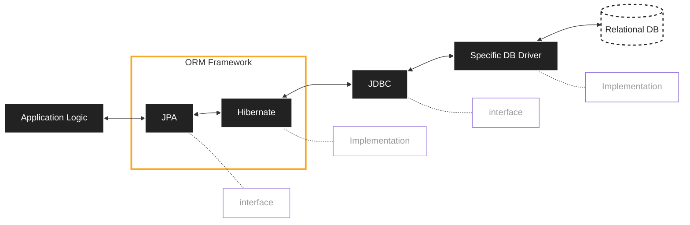

# יתרונות ORM מעבר להמרת OOP ל-SQL

## 1. הפשטה מעל דיאלקטים שונים של SQL
- כתיבת קוד אחד שעובד עם מגוון מסדי נתונים (MySQL, PostgreSQL, Oracle)
- החלפת ספק מסד נתונים בקלות ללא שינויים נרחבים בקוד
- אין צורך ללמוד תחביר ספציפי לכל מסד נתונים

## 2. אבטחה מובנית
- הגנה אוטומטית מפני SQL Injection
- טיפול אוטומטי בניקוי ובריחת תווים מיוחדים
- אכיפת הרשאות ברמת האובייקט

## 3. ניהול מטמון (Caching)
- שמירת אובייקטים שנטענו בזיכרון לשיפור ביצועים
- הפחתת פניות מיותרות למסד הנתונים
- מנגנוני רענון חכמים של המטמון

## 4. ניהול קשרים (Relationships)
- טיפול אוטומטי בקשרים מסוגים שונים (one-to-many, many-to-many)
- טעינה עצלה (Lazy Loading) של קשרים רק כשנדרש
- אופטימיזציה של שאילתות מורכבות (JOIN)

## 5. ניהול סכמה וגרסאות
- יכולת לנהל שינויים בסכמה באמצעות מיגרציות
- גישה מתוכנתת לשינויי מבנה מסד הנתונים
- תיעוד היסטורי של התפתחות הסכמה

## 6. ולידציה ברמת האובייקט
- אכיפת חוקים עסקיים ותקינות נתונים באופן עקבי
- הפעלת ולידציה לפני שמירה במסד הנתונים
- הגדרה מרוכזת של חוקי תקינות

## 7. ניהול טרנזקציות
- הפשטה של מנגנוני טרנזקציות מורכבים
- ניהול דקלרטיבי של commit ו-rollback
- טיפול אוטומטי במצבי כשל וטרנזקציות שנכשלו

## 8. טעינה עצלה לעומת להיטה (Lazy vs. Eager Loading)
- שליטה בטעינת נתונים רק כשצריך אותם
- אופטימיזציה של שאילתות לפי צרכי היישום
- יכולת לבחור אסטרטגיית טעינה לפי הקשר

## 9. ניהול מחזור חיים של אובייקטים
- מעקב אחר מצב האובייקטים (חדש, נטען, שונה, נמחק)
- סנכרון אוטומטי עם מסד הנתונים
- זיהוי חכם של שינויים באובייקטים

## 10. הפחתת קוד בוילרפלייט
- פחות קוד חוזר לפעולות CRUD בסיסיות
- התמקדות בלוגיקה עסקית במקום בתקשורת עם מסד הנתונים
- קוד נקי יותר וקל יותר לתחזוקה

## 11. עמידות לשינויים טכנולוגיים
- הגנה מפני שינויים במסד הנתונים
- הפרדה טובה יותר בין שכבת הנתונים לשכבת היישום
- אדפטציה קלה יותר לטכנולוגיות חדשות

### תרשים ארכיטקטורה

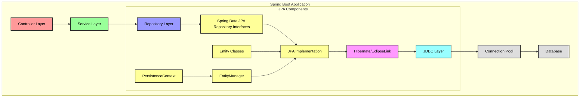

## סרטוט מפורט יותר, היררכיית המושגים - JPA, Hibernate ו-Spring Data JPA

   ```mermaid
graph TD
    A["Spring Data JPA"] -->|"מעשיר ומפשט"| B["JPA"]
    B -->|"מוגדר על ידי"| C["Java Persistence API Specification"]
    B -->|"ממומש על ידי"| D["Hibernate"]
    D -->|"משתמש ב"| E["JDBC"]
    E -->|"מתקשר עם"| F["Database"]

    A -->|"מציע"| A1["Repository Interfaces"]
    A -->|"תומך ב"| A2["Query Methods"]
    A -->|"מאפשר"| A3["Pagination & Sorting"]
    
    B -->|"מגדיר"| B1["Entity Lifecycle"]
    B -->|"מציע"| B2["JPQL"]
    B -->|"מספק"| B3["Java Annotations"]
    
    D -->|"מספק"| D1["ORM Implementation"]
    D -->|"מממש"| D2["Caching"]
    D -->|"מציע"| D3["Dialect Handling"]
    
    classDef springData fill:#6DB33F,color:white,stroke-width:2px,stroke:#333;
    classDef jpa fill:#F89406,color:white,stroke-width:2px,stroke:#333;
    classDef hibernate fill:#59666C,color:white,stroke-width:2px,stroke:#333;
    classDef jdbc fill:#1E88E5,color:white,stroke-width:2px,stroke:#333;
    classDef db fill:#455A64,color:white,stroke-width:2px,stroke:#333;
    
    class A,A1,A2,A3 springData;
    class B,B1,B2,B3 jpa;
    class D,D1,D2,D3 hibernate;
    class E jdbc;
    class F db;
```

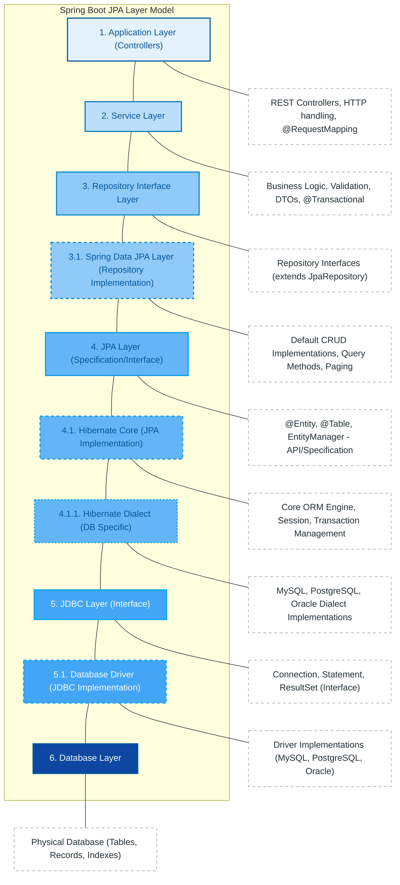

# הסבר מקיף על תרשים מודל שכבות JPA ב-Spring Boot

## מבוא
תרשים מודל השכבות מציג את הארכיטקטורה המובנית של מערכת המשתמשת ב-JPA בסביבת Spring Boot. המודל מדגיש את ההיררכיה בין הרכיבים השונים ואת ההפרדה החשובה בין interfaces למימושים.

## מבנה השכבות

### 1. שכבת האפליקציה (Controllers)
שכבה זו אחראית לטיפול בבקשות HTTP ולחשיפת ה-API החיצוני. ה-Controllers המסומנים באמצעות אנוטציות כמו `@RestController` ו-`@RequestMapping` מקבלים בקשות, מעבירים אותן לשכבת השירות ומחזירים תגובות מתאימות.

### 2. שכבת השירות (Service Layer)
שכבה זו מכילה את ה-Business Logic של האפליקציה. היא מבצעת validation, מעבדת נתונים, ומטפלת ב-transactions באמצעות אנוטציית `@Transactional`. לרוב משתמשים ב-DTOs (Data Transfer Objects) להעברת נתונים בין השכבות.

### 3. שכבת ממשק הרפוזיטורי (Repository Interface Layer)
שכבה זו מגדירה interfaces לגישה לנתונים. הממשקים קובעים את ה-contract עבור פעולות CRUD ושאילתות, ובדרך כלל יורשים מממשקים קיימים כמו `JpaRepository`.

#### 3.1. שכבת Spring Data JPA (מימוש הרפוזיטורי)
זוהי שכבת המימוש של ממשקי ה-repository. Spring Data JPA מספק מימוש אוטומטי בזמן runtime, כולל פעולות CRUD סטנדרטיות, תמיכה ב-paging ו-sorting, ומימוש שאילתות באמצעות שמות methods.

### 4. שכבת JPA (Specification/Interface)
שכבה זו מגדירה את מפרט ה-Java Persistence API, הסטנדרט לעבודה עם ORM בסביבת Java. היא כוללת את ההגדרות לאנוטציות (`@Entity`, `@Table` וכו'), את ה-EntityManager, ואת שפת השאילתות JPQL.

#### 4.1. Hibernate Core (JPA Implementation)
Hibernate הוא המימוש הנפוץ ביותר של מפרט ה-JPA. הוא משמש כמנוע ה-ORM שמבצע את המיפוי בין objects לטבלאות, מנהל sessions ותהליכי caching, ומייצר שאילתות SQL.

##### 4.1.1. Hibernate Dialect (DB Specific)
שכבת ה-Dialect מאפשרת ל-Hibernate לתקשר עם סוגים שונים של מסדי נתונים. כל dialect מתרגם בין SQL גנרי לסינטקס הספציפי של מסד נתונים מסוים (MySQL, PostgreSQL, Oracle וכו').

### 5. שכבת JDBC (Interface)
JDBC (Java Database Connectivity) היא ממשק סטנדרטי של Java לתקשורת עם מסדי נתונים. היא מגדירה interfaces כמו `Connection`, `Statement`, ו-`ResultSet` המשמשים לביצוע פעולות מול מסד הנתונים.

#### 5.1. Database Driver (JDBC Implementation)
שכבה זו כוללת מימושים ספציפיים של ממשק ה-JDBC עבור סוגי מסדי נתונים שונים. ה-drivers מבצעים את התקשורת הישירה עם מסד הנתונים.

### 6. שכבת Database
השכבה התחתונה ביותר, המייצגת את מסד הנתונים עצמו על הטבלאות, האינדקסים והרשומות שלו.

## עקרונות מפתח בארכיטקטורה

### הפרדה בין Interfaces למימושים
עיקרון חשוב בתרשים הוא ההפרדה בין interfaces/specifications למימושים שלהם:
- Repository Interface → Spring Data JPA
- JPA Specification → Hibernate
- JDBC Interface → Database Driver

הפרדה זו מאפשרת גמישות, שימוש ב-mocks לבדיקות, והחלפת מימושים ללא צורך בשינוי קוד האפליקציה.

### רמות Abstraction יורדות
ככל שיורדים בשכבות, רמת ה-abstraction יורדת והקרבה למסד הנתונים עולה:
- Controllers ו-Services עובדים ברמה מופשטת של business objects
- Repository עובד עם entities ו-DTOs
- JPA עובד עם entities מסומנות באנוטציות
- Hibernate מתרגם אנוטציות לפקודות SQL
- JDBC/Driver מבצעים תקשורת פיזית עם מסד הנתונים

### יתרונות המודל השכבתי

המודל השכבתי מספק יתרונות רבים:

1. **Separation of Concerns** - כל שכבה מתמקדת במשימה ספציפית
2. **Maintainable Code** - שינויים בשכבה אחת אינם משפיעים בהכרח על האחרות
3. **Testability** - ניתן לבדוק כל שכבה בנפרד
4. **Flexibility in JPA Implementations** - ניתן להחליף בין מימושים שונים של JPA (למשל Hibernate או EclipseLink) ללא שינוי בשכבות העליונות
5. **Database Portability** - אפשר להחליף מסדי נתונים (למשל ממעבר MySQL ל-PostgreSQL) בעזרת שינוי ה-Dialect המתאים


מודל השכבות מדגים ארכיטקטורה מובנית של יישום JPA ב-Spring Boot, עם הפרדה ברורה בין שכבות ממשק למימוש. כל שכבה בנויה על השכבה שמתחתיה, מה שמאפשר רמות abstraction גבוהות יותר בשכבות העליונות ומפשט את העבודה עם מסדי נתונים בפיתוח יישומים מבוססי Spring.


### 2. רכיבי JPA

## הגדרת סביבת עבודה

### התקנת MySQL

לצורך תרגול ועבודה עם JPA, נדרשת התקנה של סביבת MySQL כדי לבצע את התרגילים המעשיים.

#### Windows

1. **הורדת MySQL Installer**:
    - בקרו באתר ההורדות הרשמי של MySQL
    - הורידו את "MySQL Installer for Windows"

2. **הפעלת המתקין**:
    - בחרו ב-"Full" installation type
    - הגדירו סיסמה חזקה למשתמש root

#### MacOS/Linux

התקנת MySQL במערכות אלה מתבצעת בדרך כלל באמצעות Package Manager:

</div>

```bash
# Ubuntu
sudo apt update
sudo apt install mysql-server

# MacOS with Homebrew
brew install mysql
```

<div dir="rtl">

### שימוש ב-Docker

אפשרות נוחה יותר היא שימוש ב-Docker, שמאפשר הגדרה מהירה ופשוטה של סביבת MySQL ללא צורך בהתקנה מלאה:

</div>

```yaml
version: '3.8'

services:
   mysql:
      image: mysql:latest
      container_name: mysql-container
      environment:
         - MYSQL_ROOT_PASSWORD=admin
      ports:
         - "3306:3306"
      volumes:
         - mysql_data:/var/lib/mysql
      networks:
         - app-network
      restart: unless-stopped

networks:
   app-network:
      driver: bridge

volumes:
   mysql_data:
```

<div dir="rtl">

הפעלת MySQL באמצעות Docker:

</div>

```bash
docker-compose up -d
```


<div dir="rtl">

### קונפיגורציה בסיסית

לאחר התקנת MySQL, נדרש לעדכן את קבצי הקונפיגורציה של האפליקציה:

</div>

<div dir="ltr">

```properties
# MySQL Configuration
spring.datasource.url=jdbc:mysql://localhost:3306/school_db?useSSL=false&serverTimezone=UTC&useLegacyDatetimeCode=false
spring.datasource.username=school_user
spring.datasource.password=school_password
spring.datasource.driver-class-name=com.mysql.cj.jdbc.Driver

# JPA Configuration
spring.jpa.hibernate.ddl-auto=update
spring.jpa.show-sql=true
spring.jpa.properties.hibernate.format_sql=true
spring.jpa.properties.hibernate.dialect=org.hibernate.dialect.MySQL8Dialect

# Connection Pool Configuration
spring.datasource.hikari.connection-timeout=20000
spring.datasource.hikari.maximum-pool-size=5
```

</div>

<div dir="rtl">

#### הסבר על הגדרות JPA

- **spring.jpa.hibernate.ddl-auto**: מגדיר את אופן עדכון הסכמה
    - `create`: יצירת סכמה חדשה בכל הפעלה (מוחק נתונים קיימים!)
    - `update`: עדכון סכמה קיימת (לא מוחק נתונים)
    - `validate`: בדיקת התאמה בין המחלקות לסכמה
    - `none`: ללא פעולות אוטומטיות
- **spring.jpa.show-sql**: מציג שאילתות SQL המופעלות
- **spring.jpa.properties.hibernate.dialect**: מגדיר את הדיאלקט עבור בסיס הנתונים

####  Spring JPA Dialect

Dialect (דיאלקט) ב-Hibernate הוא מרכיב שמשמש כ"מתורגמן" בין קוד Java לבין בסיס הנתונים. הוא מתרגם את הוראות JPA הגנריות לתחביר SQL הספציפי של בסיס הנתונים בו אתה משתמש.

**למה חשוב להגדיר Dialect?**

1. **תמיכה בתחביר SQL ייחודי** לכל סוג בסיס נתונים
2. **יצירה אוטומטית של סכמה** בתחביר הנכון
3. **אופטימיזציות ספציפיות** לבסיס הנתונים
4. **תמיכה בתכונות מתקדמות** כמו אינדקסים מיוחדים ונתוני JSON

## יחסי גומלין בין ישויות ב-JPA

יחסי גומלין בין ישויות הם נדבך מרכזי בעבודה עם JPA ובעיצוב מערכות מידע. נסקור את סוגי היחסים השונים בין ישויות אקדמיות, תוך התמקדות בסטודנטים ומורים.

### יחסי One-to-One

יחסי One-to-One מתקיימים כאשר לכל ישות מצד אחד של היחס יש בדיוק ישות אחת מהצד השני. דוגמה טובה היא היחס בין מורה לפרטי המורה המורחבים.

#### דוגמה: יחס בין מורה לפרטי המורה

##### חד-כיווני (Unidirectional)

</div>

<div dir="ltr">

```java
@Entity
public class Teacher {
    @Id
    @GeneratedValue(strategy = GenerationType.IDENTITY)
    private Long id;
    
    private String name;
    private String department;
    
    @OneToOne
    @JoinColumn(name = "details_id")
    private TeacherDetails details;
    
    // getters and setters
}

@Entity
public class TeacherDetails {
    @Id
    @GeneratedValue(strategy = GenerationType.IDENTITY)
    private Long id;
    
    private String email;
    private String phone;
    private Integer yearsOfExperience;
    private LocalDate hireDate;
    
    // getters and setters
}
```

</div>

<div dir="rtl">

במקרה זה, המורה יודע מהם פרטיו המורחבים, אך פרטי המורה אינם "מכירים" את המורה שאליו הם משויכים.

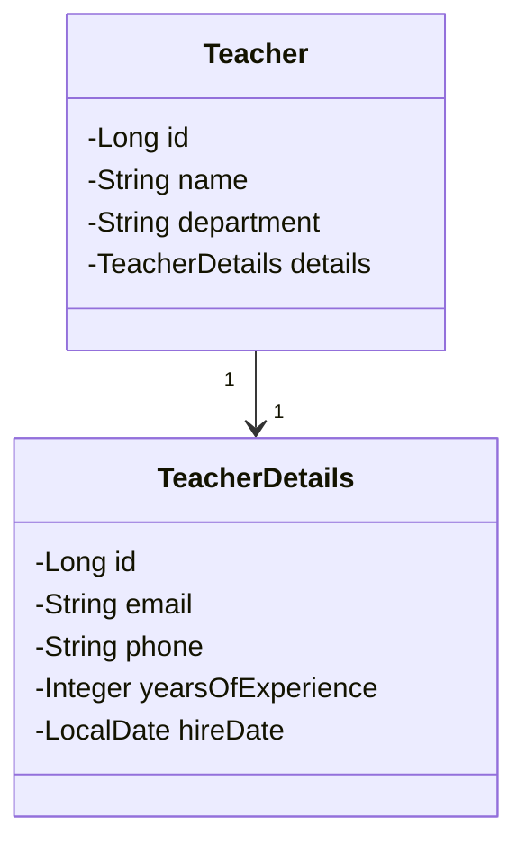

##### דו-כיווני (Bidirectional)

</div>

<div dir="ltr">

```java
@Entity
public class Teacher {
    @Id
    @GeneratedValue(strategy = GenerationType.IDENTITY)
    private Long id;
    
    private String name;
    private String department;
    
    @OneToOne
    @JoinColumn(name = "details_id")
    private TeacherDetails details;
    
    // getters and setters
}

@Entity
public class TeacherDetails {
    @Id
    @GeneratedValue(strategy = GenerationType.IDENTITY)
    private Long id;
    
    private String email;
    private String phone;
    private Integer yearsOfExperience;
    private LocalDate hireDate;
    
    @OneToOne(mappedBy = "details")
    private Teacher teacher;
    
    // getters and setters
}
```

</div>

<div dir="rtl">

בגישה הדו-כיוונית, ניתן לנווט מהמורה לפרטיו ומהפרטים חזרה למורה.

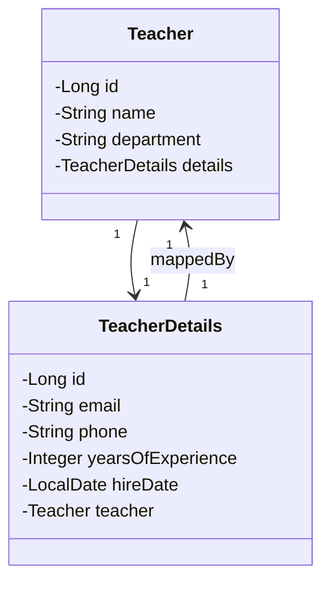

#### נקודות חשובות ביחסי One-to-One

- **בעלות על היחס**: צד אחד חייב להיות "הבעלים" של היחס (Owning side), כלומר הצד שבטבלה שלו יופיע ה-foreign key. זה מסומן ע"י `@JoinColumn`.
- **טעינה**: ברירת המחדל ב-One-to-One היא `FetchType.EAGER`
- **Cascading**: שימוש נפוץ ב-`cascade = CascadeType.ALL` לביצוע פעולות (שמירה, עדכון, מחיקה) על שתי הישויות בפעולה אחת.

### יחסי One-to-Many

יחסים אלה מתקיימים כאשר ישות אחת קשורה למספר ישויות מהצד השני, אך כל ישות מהצד השני קשורה רק לישות אחת מהצד הראשון. דוגמה טובה היא היחס בין מורה לקורסים שהוא מלמד.

#### דוגמה: יחס בין מורה לקורסים

##### חד-כיווני מצד המורה

</div>

<div dir="ltr">

```java
@Entity
public class Teacher {
    @Id
    @GeneratedValue(strategy = GenerationType.IDENTITY)
    private Long id;
    
    private String name;
    
    @OneToMany
    @JoinColumn(name = "teacher_id")
    private List<Course> courses = new ArrayList<>();
    
    // getters and setters
}

@Entity
public class Course {
    @Id
    @GeneratedValue(strategy = GenerationType.IDENTITY)
    private Long id;
    
    private String title;
    private String code;
    private Integer credits;
    
    // getters and setters - אין שדה למורה!
}
```

</div>

<div dir="rtl">

במקרה זה, המורה יודע אילו קורסים הוא מלמד, אך הקורס לא "מכיר" את המורה שמלמד אותו.

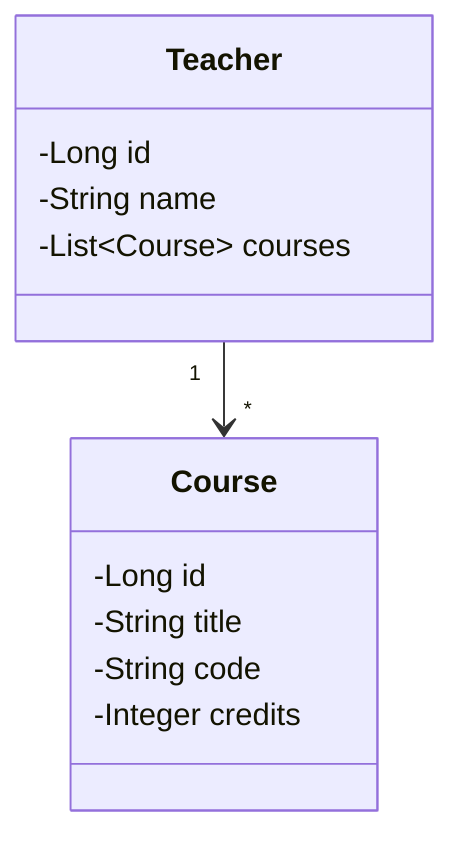

##### דו-כיווני

</div>

<div dir="ltr">

```java
@Entity
public class Teacher {
    @Id
    @GeneratedValue(strategy = GenerationType.IDENTITY)
    private Long id;
    
    private String name;
    
    @OneToMany(mappedBy = "teacher", cascade = CascadeType.ALL)
    private List<Course> courses = new ArrayList<>();
    
    // Helper methods for managing relationships
    public void addCourse(Course course) {
        courses.add(course);
        course.setTeacher(this);
    }
    
    public void removeCourse(Course course) {
        courses.remove(course);
        course.setTeacher(null);
    }
    
    // getters and setters
}

@Entity
public class Course {
    @Id
    @GeneratedValue(strategy = GenerationType.IDENTITY)
    private Long id;
    
    private String title;
    private String code;
    private Integer credits;
    
    @ManyToOne
    @JoinColumn(name = "teacher_id")
    private Teacher teacher;
    
    // getters and setters
}
```

</div>

<div dir="rtl">

בגישה הדו-כיוונית, המורה מכיר את כל הקורסים שהוא מלמד, וכל קורס מכיר את המורה שמלמד אותו.

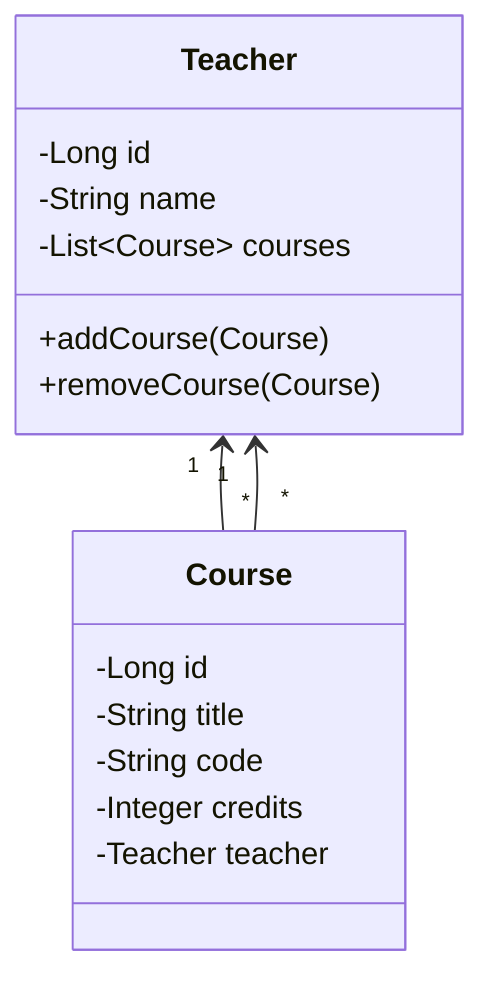

#### נקודות חשובות ביחסי One-to-Many

- **בעלות על היחס**: בקשר דו-כיווני, צד ה-Many-to-One (`Course` בדוגמה) הוא תמיד הבעלים של היחס ומכיל את ה-foreign key.
- **Mappedby**: בצד ה-One-to-Many (`Teacher` בדוגמה) יש להשתמש ב-`mappedBy` כדי לציין את השדה בצד השני שמכיל את היחס.
- **ניהול היחס**: מומלץ להוסיף שיטות עזר כמו `addCourse` ו-`removeCourse` כדי לטפל בשני צדדי היחס בפעולה אחת.
- **Cascade**: שקול בקפידה את הגדרות ה-cascade, במיוחד `CascadeType.REMOVE` שיכול לגרום למחיקות משורשרות לא רצויות.
- **Fetch Type**: ברירת המחדל ביחסי OneToMany היא LAZY כדי למנוע טעינת אוספים גדולים שלא לצורך.

### יחסי Many-to-Many

יחסי Many-to-Many מתקיימים כאשר ישויות מצד אחד יכולות להיות קשורות למספר ישויות מהצד השני, ולהיפך. דוגמה קלאסית היא היחס בין סטודנטים לקורסים - סטודנט יכול להירשם למספר קורסים, וקורס יכול לכלול מספר סטודנטים.

#### דוגמה: יחס בין סטודנטים לקורסים

##### חד-כיווני

</div>

<div dir="ltr">

```java
@Entity
public class Student {
    @Id
    @GeneratedValue(strategy = GenerationType.IDENTITY)
    private Long id;
    
    private String firstName;
    private String lastName;
    private String email;
    
    @ManyToMany
    @JoinTable(
        name = "student_course",
        joinColumns = @JoinColumn(name = "student_id"),
        inverseJoinColumns = @JoinColumn(name = "course_id")
    )
    private Set<Course> courses = new HashSet<>();
    
    // getters and setters
}

@Entity
public class Course {
    @Id
    @GeneratedValue(strategy = GenerationType.IDENTITY)
    private Long id;
    
    private String title;
    private String code;
    
    // אין שדה לסטודנטים!
    
    // getters and setters
}
```

</div>

<div dir="rtl">

במקרה זה, הסטודנט יודע לאילו קורסים הוא רשום, אך הקורס אינו "מכיר" את הסטודנטים הרשומים אליו.

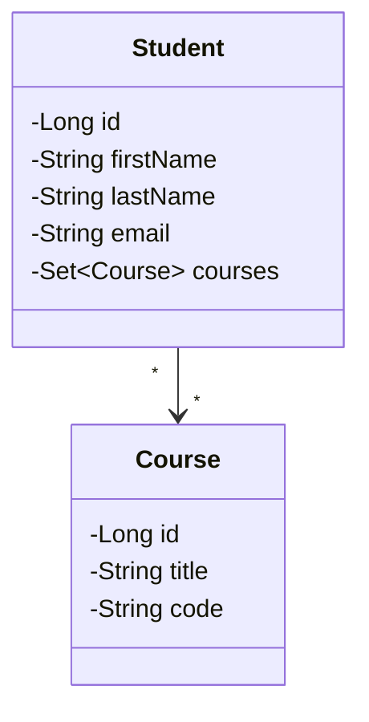

##### דו-כיווני

</div>

<div dir="ltr">

```java
@Entity
public class Student {
    @Id
    @GeneratedValue(strategy = GenerationType.IDENTITY)
    private Long id;
    
    private String firstName;
    private String lastName;
    private String email;
    
    @ManyToMany
    @JoinTable(
        name = "student_course",
        joinColumns = @JoinColumn(name = "student_id"),
        inverseJoinColumns = @JoinColumn(name = "course_id")
    )
    private Set<Course> courses = new HashSet<>();
    
    // Helper methods
    public void enrollInCourse(Course course) {
        courses.add(course);
        course.getStudents().add(this);
    }
    
    public void dropCourse(Course course) {
        courses.remove(course);
        course.getStudents().remove(this);
    }
    
    // getters and setters
}

@Entity
public class Course {
    @Id
    @GeneratedValue(strategy = GenerationType.IDENTITY)
    private Long id;
    
    private String title;
    private String code;
    
    @ManyToMany(mappedBy = "courses")
    private Set<Student> students = new HashSet<>();
    
    // getters and setters
}
```

</div>

<div dir="rtl">

בגישה הדו-כיוונית, הסטודנט יודע לאילו קורסים הוא רשום, והקורס יודע אילו סטודנטים רשומים אליו.

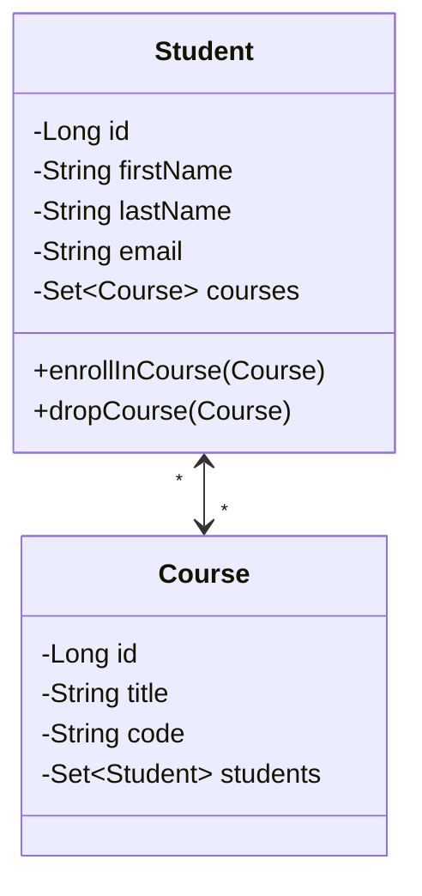

##### Many-to-Many עם ישות קשר

במקרים רבים, יחס Many-to-Many פשוט אינו מספיק, ויש צורך בשמירת מידע נוסף על היחס עצמו (למשל, תאריך רישום, ציון בקורס). במקרה כזה, יוצרים ישות קשר מפורשת:

</div>

<div dir="ltr">

```java
@Entity
public class Student {
    @Id
    @GeneratedValue(strategy = GenerationType.IDENTITY)
    private Long id;
    
    private String firstName;
    private String lastName;
    private String email;
    
    @OneToMany(mappedBy = "student", cascade = CascadeType.ALL)
    private Set<Enrollment> enrollments = new HashSet<>();
    
    // getters and setters
}

@Entity
public class Course {
    @Id
    @GeneratedValue(strategy = GenerationType.IDENTITY)
    private Long id;
    
    private String title;
    private String code;
    
    @OneToMany(mappedBy = "course", cascade = CascadeType.ALL)
    private Set<Enrollment> enrollments = new HashSet<>();
    
    // getters and setters
}

@Entity
public class Enrollment {
    @Id
    @GeneratedValue(strategy = GenerationType.IDENTITY)
    private Long id;
    
    @ManyToOne
    @JoinColumn(name = "student_id")
    private Student student;
    
    @ManyToOne
    @JoinColumn(name = "course_id")
    private Course course;
    
    private LocalDate enrollmentDate;
    private Double grade;
    
    @Enumerated(EnumType.STRING)
    private EnrollmentStatus status;
    
    public enum EnrollmentStatus {
        ACTIVE, COMPLETED, WITHDRAWN
    }
    
    // getters and setters
}
```

</div>

<div dir="rtl">

גישה זו מספקת גמישות רבה יותר, מאפשרת שמירת מידע על היחס עצמו, ושוברת את היחס Many-to-Many לשני יחסי One-to-Many.

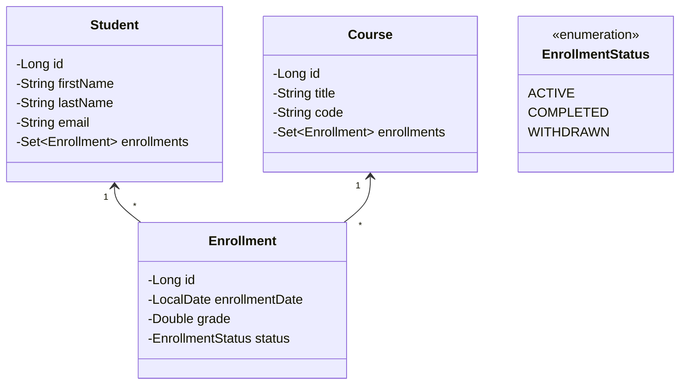

#### נקודות חשובות ביחסי Many-to-Many

- **טבלת הקשר**: בקשר Many-to-Many פשוט, JPA יוצר טבלת קשר אוטומטית. השתמש ב-`@JoinTable` כדי להגדיר את שם הטבלה ועמודותיה.
- **בעלות על היחס**: בקשר דו-כיווני, אחד הצדדים חייב להיות הבעלים של היחס (לרוב הצד שמגדיר את `@JoinTable`), והצד השני משתמש ב-`mappedBy`.
- **ביצועים**: יחסי Many-to-Many דו-כיווניים עלולים להיות פחות יעילים מבחינת ביצועים. שקול להשתמש ביחס חד-כיווני או בישות קשר מפורשת.
- **ישות קשר מפורשת**: כאשר יש צורך במידע נוסף על היחס, הפוך את היחס Many-to-Many לשני יחסי One-to-Many דרך ישות ביניים.

### שיקולים בבחירת סוג היחס

#### יתרונות של יחסים חד-כיווניים (Unidirectional)

1. **פשטות** - קל יותר להבין ולתחזק
2. **פחות קוד** - אין צורך בהגדרת היחס בשני צדדים
3. **פחות שגיאות** - אין סיכון לניהול לא עקבי של היחס
4. **ביצועים** - פחות joins ופחות טעינות מיותרות

#### יתרונות של יחסים דו-כיווניים (Bidirectional)

1. **גישה קלה** - אפשר לגשת ליחס מכל צד
2. **שאילתות פשוטות יותר** - לא נדרשות שאילתות נוספות
3. **גמישות** - אפשר לעבור בין ישויות בקלות

#### מתי להשתמש בחד-כיווני ומתי בדו-כיווני?

**שימוש ביחס חד-כיווני** מומלץ כאשר:
- הגישה נדרשת בעיקר מכיוון אחד
- פשטות המערכת חשובה יותר מגמישות מלאה
- בפרויקטים קטנים או בינוניים
- ביצועים הם פקטור קריטי

**שימוש ביחס דו-כיווני** מומלץ כאשר:
- נדרשת גישה תכופה מכל כיוון
- במודלים מורכבים עם ניווט רב בין ישויות
- כאשר יש ערך בשימוש ב-cascading operations

## שאילתות בסיסיות ומתקדמות

### JPQL לעומת SQL

JPQL (Java Persistence Query Language) היא שפת שאילתות אובייקטואלית המשמשת ב-JPA. בניגוד ל-SQL הפועלת על טבלאות ועמודות בבסיס נתונים, JPQL פועלת על ישויות Java ותכונותיהן.

#### הבדלים עיקריים בין JPQL ל-SQL

| מאפיין | JPQL | SQL |
|---------|------|-----|
| פועל על | ישויות ותכונות Java | טבלאות ועמודות בבסיס נתונים |
| תלוי במודל | כן (תלוי במודל האובייקטים) | לא (פועל ישירות מול בסיס הנתונים) |
| מותאם אישית לפי בסיס נתונים | לא (אחיד בכל בסיסי הנתונים) | כן (תחביר עשוי להשתנות בין ספקים) |
| רגישות לגודל אותיות | כן (בשמות ישויות ותכונות) | תלוי בבסיס הנתונים |
| תפקיד | חלק משכבת ה-ORM | שפה לניהול בסיסי נתונים |

#### דוגמאות להשוואת שאילתות

##### בחירת כל הישויות

</div>

<div dir="ltr">

```jpql
// JPQL
SELECT e FROM Employee e

// SQL
SELECT * FROM employees
```

</div>

<div dir="rtl">

##### בחירה עם תנאי WHERE

</div>

<div dir="ltr">

```jpql
// JPQL
SELECT e FROM Employee e WHERE e.salary > 50000

// SQL
SELECT * FROM employees WHERE salary > 50000
```

</div>

<div dir="rtl">

##### JOIN

</div>

<div dir="ltr">

```jpql
// JPQL
SELECT e FROM Employee e JOIN e.department d

// SQL
SELECT e.* FROM employees e INNER JOIN departments d ON e.department_id = d.id
```

</div>

<div dir="rtl">

#### כינויים (Aliases) ב-JPQL

ב-JPQL חובה להגדיר כינוי (alias) לכל ישות בשאילתה. הכינוי מוגדר מיד לאחר שם הישות (לדוגמה: `Employee e`). JPQL תוכנן כך במכוון כדי לשמור על עקביות ולהבטיח שתמיד יהיה כינוי זמין להרחבת השאילתה בהמשך.

#### JOIN FETCH - מיוחד ל-JPQL

JPQL מספק מנגנון מיוחד בשם JOIN FETCH למניעת בעיית N+1 (שנדון בה בהמשך):

</div>

<div dir="ltr">

```jpql
// JPQL
SELECT e FROM Employee e JOIN FETCH e.department

// SQL המקביל (אך אינו זהה בהתנהגות)
SELECT e.*, d.* FROM employees e INNER JOIN departments d ON e.department_id = d.id
```

</div>

<div dir="rtl">

הייחוד של JOIN FETCH הוא שהוא מבצע טעינה מיידית של קשרים שמוגדרים כ-lazy, ובכך מונע בעיית N+1 queries.

### סוגי שאילתות

ב-Spring Data JPA ניתן לבצע שאילתות במספר דרכים:

#### 1. מתודות CRUD מובנות

Spring Data JPA מספק מתודות CRUD בסיסיות מוכנות:

</div>

<div dir="ltr">

```java
// נמצאות בממשק JpaRepository
public interface JpaRepository<T, ID> extends PagingAndSortingRepository<T, ID>, QueryByExampleExecutor<T> {
    <S extends T> S save(S entity);
    Optional<T> findById(ID id);
    List<T> findAll();
    void deleteById(ID id);
    // ...
}
```

</div>

<div dir="rtl">

#### 2. שאילתות מבוססות שמות מתודות (Query Methods)

Spring Data JPA מאפשר יצירת שאילתות אוטומטית על ידי שיום נכון של מתודות:

</div>

<div dir="ltr">

```java
public interface StudentRepository extends JpaRepository<Student, Long> {
    // מחזיר את כל הסטודנטים עם שם משפחה מסוים
    List<Student> findByLastName(String lastName);
    
    // מחזיר את כל הסטודנטים עם גיל גדול מערך מסוים
    List<Student> findByAgeGreaterThan(double age);
    
    // מחזיר את הסטודנט עם אימייל מסוים (מניח שאימייל הוא ייחודי)
    Optional<Student> findByEmail(String email);
    
    // מחזיר את כל הסטודנטים ששם הפרטי שלהם מתחיל באות מסוימת, ממוינים לפי גיל
    List<Student> findByFirstNameStartingWithOrderByAgeDesc(String startingLetter);
}
```

</div>

<div dir="rtl">

#### 3. שאילתות JPQL מותאמות עם @Query

ניתן להגדיר שאילתות JPQL מותאמות אישית:

</div>

<div dir="ltr">

```java
public interface StudentRepository extends JpaRepository<Student, Long> {
    // שאילתת JPQL מותאמת
    @Query("SELECT s FROM Student s WHERE s.firstName LIKE %:name% OR s.lastName LIKE %:name%")
    List<Student> findByNameContaining(@Param("name") String name);
    
    // שאילתה עם JOIN
    @Query("SELECT s FROM Student s JOIN s.details d WHERE d.address LIKE %:city%")
    List<Student> findStudentsInCity(@Param("city") String city);
}
```

</div>

<div dir="rtl">

#### 4. שאילתות Native SQL

לפעמים יש צורך להשתמש בשאילתות SQL מקוריות:

</div>

<div dir="ltr">

```java
public interface StudentRepository extends JpaRepository<Student, Long> {
    // שאילתת SQL מקורית
    @Query(value = "SELECT * FROM students s WHERE YEAR(s.birth_date) = :year", nativeQuery = true)
    List<Student> findStudentsBornInYear(@Param("year") int year);
}
```

</div>

<div dir="rtl">

### שימוש ב-Query Methods

Spring Data JPA מאפשר יצירת שאילתות אוטומטית על ידי שיום נכון של מתודות. להלן כמה דוגמאות לשיטות נפוצות:

| פעולה | דוגמאות |
|--------|----------|
| find...By | findByLastName, findByEmail |
| count...By | countByLastName, countByStatus |
| delete...By | deleteByStatus, deleteById |
| ...First<n>... | findFirst5ByOrderByNameAsc |
| ...Top<n>... | findTop10ByDepartment |
| ...Distinct... | findDistinctByCategory |

#### מילות מפתח נפוצות ב-Query Methods

- **And, Or**: `findByFirstNameAndLastName`, `findByAgeOrEmail`
- **Equals**: `findByFirstName` (ברירת מחדל)
- **GreaterThan, LessThan**: `findByAgeGreaterThan`, `findByAgeLessThan`
- **Between**: `findByAgeBetween`
- **Like, NotLike**: `findByFirstNameLike`, `findByLastNameNotLike`
- **StartingWith, EndingWith, Containing**: `findByFirstNameStartingWith`
- **IsNull, IsNotNull**: `findByTeacherIsNull`, `findByEmailIsNotNull`
- **OrderBy**: `findByLastNameOrderByFirstNameAsc`

## אופטימיזציה וביצועים

### בעיית N+1

בעיית N+1 היא בעיית ביצועים נפוצה בתחום מיפוי אובייקטים בבסיסי נתונים (ORM). הבעיה מתרחשת כאשר אפליקציה מבצעת שאילתת בסיס נתונים אחת כדי לאחזר רשימה של N פריטים, ואז מבצעת שאילתה נוספת עבור כל פריט כדי לקבל מידע קשור.

#### דוגמה על בסיס תלמיד ומורה

נניח שיש לנו מערכת שבה למורה יש מספר תלמידים, ולכל תלמיד יש פרטים נוספים (StudentDetails):

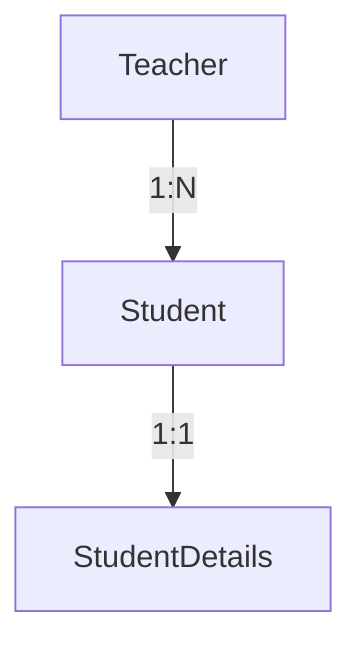

כאשר נרצה להציג את כל המורים עם התלמידים שלהם והפרטים של כל תלמיד, בעיית N+1 תתרחש אם:

1. מבצעים שאילתה אחת להביא את כל המורים (1)
2. לכל מורה, מבצעים שאילתה להביא את התלמידים שלו (N מורים)
3. לכל תלמיד, מבצעים שאילתה להביא את הפרטים שלו (M תלמידים)

כך במקום שאילתה אחת מורכבת, מבצעים 1 + N + (N * M) שאילתות!

#### מדוע בעיית N+1 היא בעיה משמעותית?

1. **ביצועים ירודים**: ריבוי שאילתות גורם לעומס רב על בסיס הנתונים
2. **שימוש יתר ברשת**: כל שאילתה דורשת תקשורת נפרדת בין האפליקציה לבסיס הנתונים
3. **חוויית משתמש גרועה**: זמני תגובה איטיים מובילים לחוויית משתמש גרועה
4. **בעיות סקלביליות**: ככל שכמות הנתונים גדלה, הבעיה מחמירה

### פתרונות לבעיית N+1

#### 1. שימוש ב-JOIN FETCH בשאילתות JPQL

פתרון טוב לבעיית N+1 הוא להשתמש בשאילתות JOIN FETCH:

</div>

<div dir="ltr">

```java
@Repository
public interface TeacherRepository extends JpaRepository<Teacher, Long> {
    @Query("SELECT t FROM Teacher t LEFT JOIN FETCH t.students")
    List<Teacher> findAllWithStudents();
    
    @Query("SELECT t FROM Teacher t LEFT JOIN FETCH t.students s LEFT JOIN FETCH s.details")
    List<Teacher> findAllWithStudentsAndDetails();
}
```

</div>

<div dir="rtl">

שאילתות אלה מנחות את JPA לבצע joins ולטעון את כל הנתונים הנדרשים בשאילתה אחת, במקום לבצע שאילתות נוספות לטעינת הקשרים.

#### 2. שימוש ב-EntityGraph של JPA

EntityGraph מאפשר לנו להגדיר אילו יחסים לטעון באופן מיידי:

</div>

<div dir="ltr">

```java
@Repository
public interface TeacherRepository extends JpaRepository<Teacher, Long> {
    @EntityGraph(attributePaths = {"students", "students.details"})
    List<Teacher> findAll();
}
```

</div>

<div dir="rtl">

#### 3. שימוש ב-Batch Fetching

Hibernate מאפשר לנו להגדיר batch size, שמאפשר טעינת מספר אובייקטים קשורים בבת אחת:

</div>

<div dir="ltr">

```java
@Entity
public class Teacher {
    // ...
    
    @OneToMany(mappedBy = "teacher")
    @BatchSize(size = 30) // טעינת 30 תלמידים בבת אחת
    private List<Student> students;
    
    // ...
}
```

</div>

<div dir="rtl">

#### 4. שאילתות מותאמות אישית עם הפרדת אחריות

לפעמים הפתרון הטוב ביותר הוא לכתוב שאילתות ספציפיות עבור המידע שאנחנו צריכים:

</div>

<div dir="ltr">

```java
@Repository
public interface TeacherRepository extends JpaRepository<Teacher, Long> {
    // שליפת נתוני מורה בסיסיים
    List<Teacher> findAll();
    
    // שליפת פרטי תלמידים למורה ספציפי (כאשר נדרש)
    @Query("SELECT s FROM Student s JOIN s.teacher t WHERE t.id = :teacherId")
    List<Student> findStudentsByTeacherId(@Param("teacherId") Long teacherId);
}
```

</div>

<div dir="rtl">

### Lazy לעומת Eager Loading

JPA מציע שני מצבי טעינה עבור יחסים בין ישויות:

#### Lazy Loading (טעינה עצלה)

ב-Lazy Loading, האובייקטים הקשורים (כמו התלמידים של מורה) אינם נטענים באופן מיידי עם האובייקט העיקרי. הם נטענים רק כאשר יש גישה ספציפית אליהם.

**יתרונות**:
- יעילות זיכרון - טוענים רק מה שצריך
- ביצועים טובים יותר בטעינה הראשונית
- פחות עומס על הרשת ובסיס הנתונים

**חסרונות**:
- יכול לגרום לבעיית N+1 אם לא מטופל כראוי
- דורש שימוש בטרנזקציה פתוחה בעת הגישה לאוספים

#### Eager Loading (טעינה להוטה)

ב-Eager Loading, האובייקטים הקשורים נטענים מיד עם האובייקט העיקרי, בשאילתה אחת.

**יתרונות**:
- אין בעיית N+1
- לא צריך לדאוג לטרנזקציות פתוחות

**חסרונות**:
- צריכת זיכרון גבוהה יותר
- טעינת נתונים שאולי לא יהיה בהם שימוש
- ביצועים פחות טובים עבור אובייקטים עם יחסים רבים

#### ברירות המחדל של JPA:

</div>
(טעינה להוטה)

`@ManyToOne, @OneToOne` : `FetchType.EAGER` 

(טעינה עצלה)

`@OneToMany, @ManyToMany` : `FetchType.LAZY` 

<div dir="rtl">

מומלץ לשנות את ברירות המחדל הללו בהתאם לדפוסי השימוש של האפליקציה. לדוגמה:

</div>

<div dir="ltr">

```java
@Entity
public class Teacher {
    // ...
    
    @OneToMany(mappedBy = "teacher", fetch = FetchType.LAZY)
    private List<Student> students = new ArrayList<>();
    
    // ...
}

@Entity
public class Student {
    // ...
    
    @ManyToOne(fetch = FetchType.LAZY)
    @JoinColumn(name = "teacher_id")
    private Teacher teacher;
    
    @OneToOne(fetch = FetchType.LAZY)
    @JoinColumn(name = "details_id")
    private StudentDetails details;
    
    // ...
}
```

</div>

<div dir="rtl">

### שימוש ב-JOIN FETCH

JOIN FETCH הוא מנגנון רב-עוצמה בJPQL שמאפשר לציין במדויק אילו יחסים לטעון באופן מיידי, בלי קשר להגדרת ה-FetchType שלהם.

#### שימוש בסיסי ב-JOIN FETCH

</div>

<div dir="ltr">

```java
@Query("SELECT t FROM Teacher t JOIN FETCH t.students WHERE t.subject = :subject")
List<Teacher> findTeachersWithStudentsBySubject(@Param("subject") String subject);
```

</div>

<div dir="rtl">

#### טעינת יחסים מרובים ב-JOIN FETCH

</div>

<div dir="ltr">

```java
@Query("SELECT s FROM Student s " +
       "LEFT JOIN FETCH s.details " +
       "LEFT JOIN FETCH s.teachers " +
       "WHERE s.lastName = :lastName")
List<Student> findStudentsWithDetailsAndTeachersByLastName(@Param("lastName") String lastName);
```

</div>

<div dir="rtl">

#### מגבלות של JOIN FETCH

1. **בעיות עם מספר אוספים**: אין אפשרות לבצע JOIN FETCH על יותר מאוסף אחד (לדוגמה, אם למורה יש גם תלמידים וגם קורסים, לא ניתן לבצע JOIN FETCH על שניהם בשאילתה אחת)

2. **Cartesian Product**: כשמשתמשים ב-JOIN FETCH עם אוספים, יכול להיווצר מכפלה קרטזית שמשכפלת שורות. ניתן לפתור זאת באמצעות `DISTINCT`:

</div>

<div dir="ltr">

```java
@Query("SELECT DISTINCT t FROM Teacher t JOIN FETCH t.students")
List<Teacher> findAllTeachersWithStudents();
```

</div>

<div dir="rtl">

3. **ביצועים עם אוספים גדולים**: עבור אוספים גדולים מאוד, JOIN FETCH עלול לגרום לבעיות ביצועים. במקרים אלו, שקול שימוש ב-pagination או ב-batch fetching.

## ניהול עסקאות ב-JPA

ניהול עסקאות (Transaction Management) הוא אחד המרכיבים הקריטיים ביותר בפיתוח אפליקציות עם JPA. עסקה (Transaction) היא רצף של פעולות שמתבצעות כיחידה אטומית אחת - או שכולן מתבצעות בהצלחה, או שאף אחת מהן אינה מתבצעת.

### עקרונות ACID

עסקאות בבסיסי נתונים נדרשות לעמוד בארבע תכונות בסיסיות, המכונות ACID:

1. **אטומיות (Atomicity)** - עסקה מתבצעת במלואה או לא מתבצעת כלל.
2. **עקביות (Consistency)** - עסקה מעבירה את בסיס הנתונים ממצב תקין אחד למצב תקין אחר.
3. **בידוד (Isolation)** - עסקאות מבודדות זו מזו. תוצאות של עסקה אחת אינן נראות לעסקאות אחרות לפני שהיא מסתיימת.
4. **עמידות (Durability)** - ברגע שעסקה הושלמה, התוצאות שלה נשמרות בבסיס הנתונים לתמיד.

### רמות בידוד עסקאות

רמות בידוד שונות פותרות בעיות שונות של בקרת מקביליות:

#### 1. READ_UNCOMMITTED
הרמה הנמוכה ביותר של בידוד. מאפשרת "קריאה מלוכלכת" (Dirty Read) - קריאת נתונים שטרם בוצעו (uncommitted).

#### 2. READ_COMMITTED
מונעת קריאה מלוכלכת אך מאפשרת "קריאה לא חוזרת" (Non-repeatable Read) - קריאה חוזרת של אותו נתון עלולה להחזיר ערכים שונים.

#### 3. REPEATABLE_READ
מבטיחה שקריאות חוזרות של אותם נתונים יחזירו אותן תוצאות, אך עדיין מאפשרת "קריאת רוח רפאים" (Phantom Read) - שאילתות חוזרות עלולות להחזיר שורות חדשות.

#### 4. SERIALIZABLE
הרמה הגבוהה ביותר של בידוד. מונעת את כל הבעיות הנ"ל, אך עם עלות משמעותית בביצועים.

#### סיכום רמות הבידוד והבעיות שהן פותרות:

| רמת בידוד | Dirty Read | Non-repeatable Read | Phantom Read | השפעה על ביצועים |
|------------|:----------:|:-------------------:|:------------:|:----------------:|
| READ_UNCOMMITTED | לא מונע | לא מונע | לא מונע | הכי טובים |
| READ_COMMITTED | מונע | לא מונע | לא מונע | טובים |
| REPEATABLE_READ | מונע | מונע | לא מונע | בינוניים |
| SERIALIZABLE | מונע | מונע | מונע | הכי גרועים |

### שימוש ב-@Transactional

Spring מספק מנגנון פשוט לניהול עסקאות באמצעות האנוטציה `@Transactional`.

</div>

<div dir="ltr">

```java
@Service
public class StudentService {
    @Autowired
    private StudentRepository studentRepository;
    
    @Transactional
    public Student createStudent(Student student) {
        return studentRepository.save(student);
    }
}
```

</div>

<div dir="rtl">

#### מאפייני @Transactional

האנוטציה `@Transactional` תומכת במספר מאפיינים:

1. **propagation** - כיצד העסקה מתנהגת ביחס לעסקאות אחרות:
    - `REQUIRED` (ברירת מחדל) - משתמש בעסקה קיימת אם יש, אחרת יוצר חדשה
    - `REQUIRES_NEW` - תמיד יוצר עסקה חדשה
    - `SUPPORTS` - משתמש בעסקה קיימת אם יש, אחרת פועל ללא עסקה
    - `MANDATORY` - חייב להיות בתוך עסקה קיימת
    - `NEVER` - לא יכול לפעול בתוך עסקה
    - `NOT_SUPPORTED` - משעה עסקה קיימת
    - `NESTED` - יוצר עסקה מקוננת (נקודת שמירה) בתוך העסקה הקיימת

2. **isolation** - רמת הבידוד של העסקה (כמפורט לעיל)

3. **timeout** - הזמן המרבי בשניות שהעסקה יכולה להימשך

4. **readOnly** - מסמן שהעסקה היא לקריאה בלבד (אופטימיזציה)

5. **rollbackFor/noRollbackFor** - מגדיר אילו חריגות יגרמו או לא יגרמו לביטול העסקה

#### דוגמת קוד מורכבת:

</div>

<div dir="ltr">

```java
@Service
public class BankService {
    @Autowired
    private AccountRepository accountRepository;
    
    // עסקה עם שילוב מאפיינים
    @Transactional(
        propagation = Propagation.REQUIRED, 
        isolation = Isolation.READ_COMMITTED,
        timeout = 30,
        readOnly = false,
        rollbackFor = {InsufficientFundsException.class},
        noRollbackFor = {MinorValidationException.class}
    )
    public void transferMoney(Long fromAccountId, Long toAccountId, BigDecimal amount) 
            throws InsufficientFundsException {
        Account fromAccount = accountRepository.findById(fromAccountId)
                .orElseThrow(() -> new AccountNotFoundException("Account not found: " + fromAccountId));
        Account toAccount = accountRepository.findById(toAccountId)
                .orElseThrow(() -> new AccountNotFoundException("Account not found: " + toAccountId));
        
        if (fromAccount.getBalance().compareTo(amount) < 0) {
            throw new InsufficientFundsException("Insufficient funds in account: " + fromAccountId);
        }
        
        fromAccount.setBalance(fromAccount.getBalance().subtract(amount));
        toAccount.setBalance(toAccount.getBalance().add(amount));
        
        accountRepository.save(fromAccount);
        accountRepository.save(toAccount);
        
        // העסקה תתבצע בהצלחה או תבוטל לחלוטין אם תהיה בעיה
    }
}
```

</div>

<div dir="rtl">

### Best Practices בניהול עסקאות

1. **להגדיר עסקאות ברמה הנכונה** - לא נמוך מדי (ביצועים) ולא גבוה מדי (deadlocks)
2. **לקצר את משך העסקאות** - להימנע מפעולות ארוכות כמו API calls חיצוניים בתוך עסקה
3. **להשתמש ב-readOnly לשאילתות** - אופטימיזציות משמעותיות לפעולות קריאה בלבד
4. **להיזהר מעסקאות מקוננות** - להבין כיצד propagation משפיע על התנהגות העסקה
5. **לתכנן נכון את ACID** - לבחור בין קונסיסטיות לזמינות בהתאם לדרישות העסקיות

## ארכיטקטורת מערכת ניהול סטודנטים ומורים

מערכת ניהול סטודנטים ומורים היא אפליקציית Spring Boot המספקת REST API לניהול מידע אקדמי. המערכת מאפשרת ניהול סטודנטים, פרטיהם הנוספים, מורים, והקשרים ביניהם.

### מבנה הפרויקט

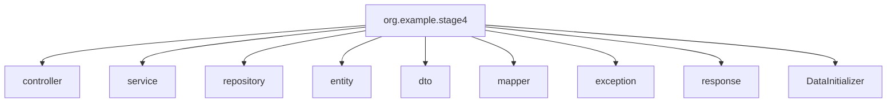

### מודל הנתונים

מודל הנתונים של המערכת מורכב משלוש ישויות עיקריות:

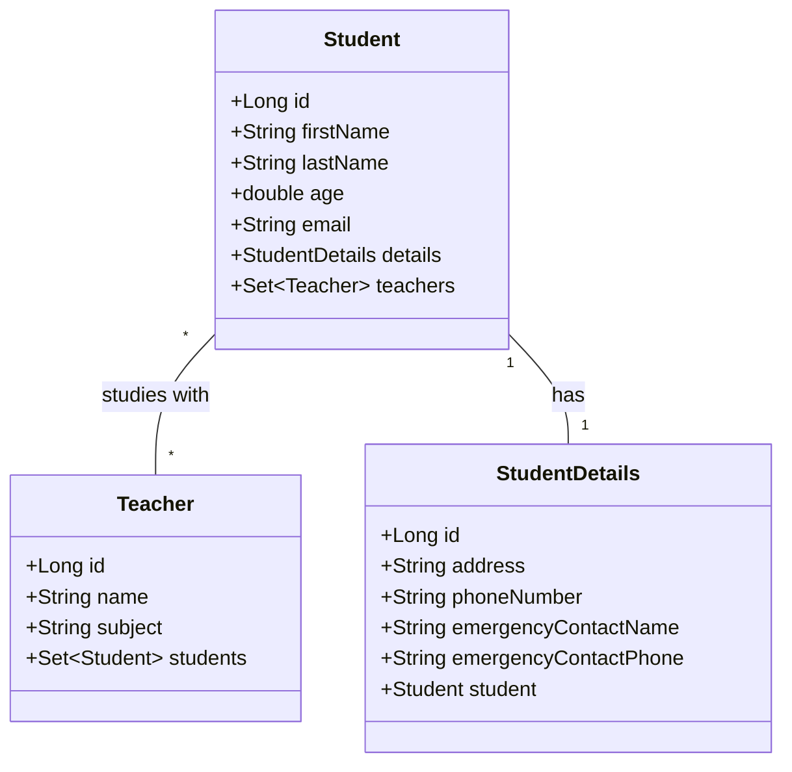

#### יחסים במודל

1. **Student-StudentDetails**: יחס One-to-One. כל סטודנט יכול להיות בעל סט פרטים אחד, וכל סט פרטים שייך לסטודנט אחד.
2. **Student-Teacher**: יחס Many-to-Many. כל סטודנט יכול ללמוד אצל מספר מורים, וכל מורה יכול ללמד מספר סטודנטים.

### תהליכי עבודה עיקריים

#### תהליך הקצאת מורה לסטודנט

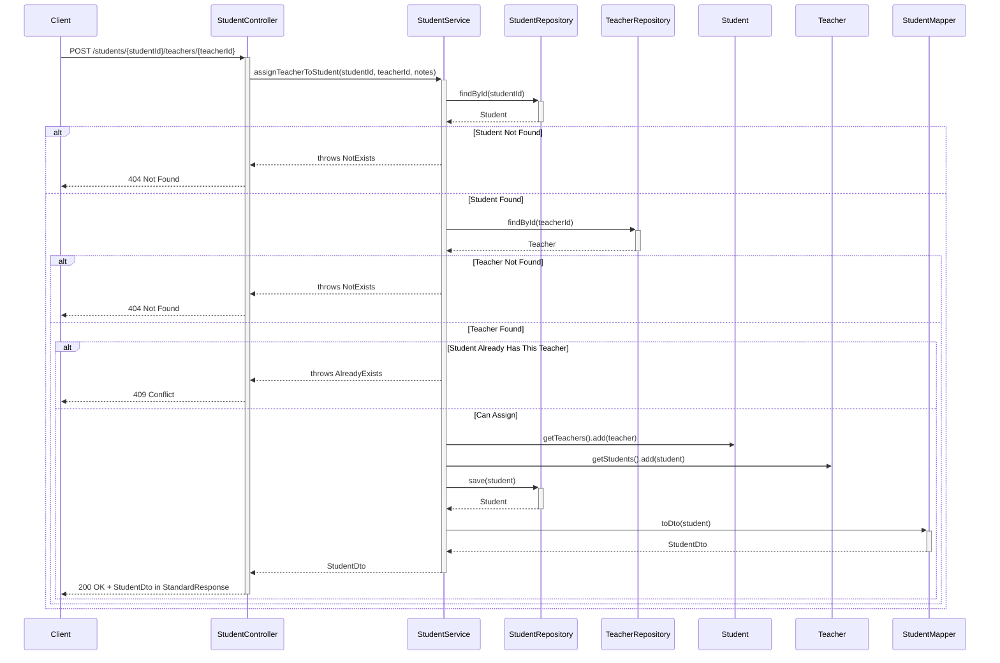

#### זרימת מידע כללית במערכת

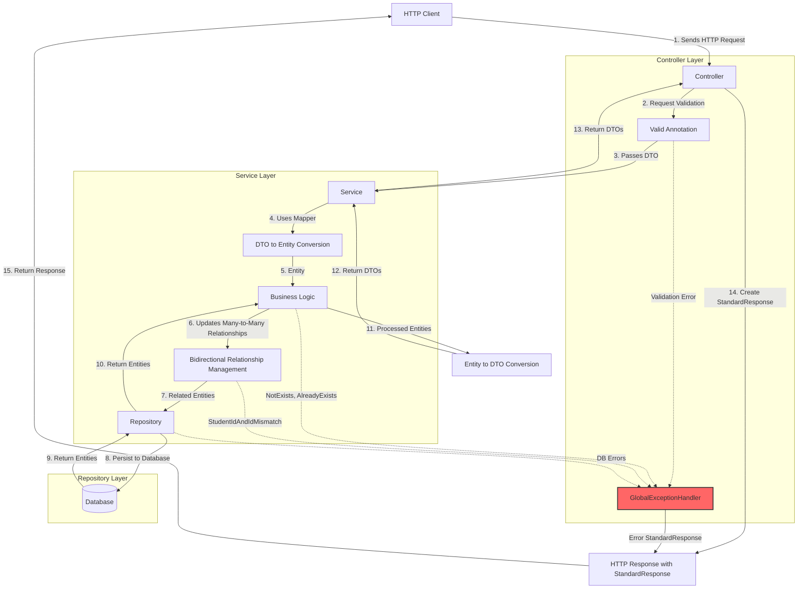

## טיפול בשגיאות

### GlobalExceptionHandler

המערכת מיישמת מנגנון טיפול בשגיאות גלובלי באמצעות `GlobalExceptionHandler`. מנגנון זה מבטיח תגובות אחידות עבור סוגי שגיאות שונים.

</div>

<div dir="ltr">

```java
@ControllerAdvice
public class GlobalExceptionHandler {

    /**
     * takes care of the exception when a resource is not found, 404 Not Found
     */
    @ExceptionHandler(NotExists.class)
    public ResponseEntity<StandardResponse> handleNotExists(NotExists ex, WebRequest request) {
        Map<String, String> details = new HashMap<>();
        details.put("type", "Resource Not Found");
        details.put("message", ex.getMessage());
        
        StandardResponse response = new StandardResponse("error", null, details);
        return new ResponseEntity<>(response, HttpStatus.NOT_FOUND);
    }

    /**
     * takes care of the exception when a resource already exists, 409 Conflict
     */
    @ExceptionHandler(AlreadyExists.class)
    public ResponseEntity<StandardResponse> handleAlreadyExists(AlreadyExists ex, WebRequest request) {
        Map<String, String> details = new HashMap<>();
        details.put("type", "Resource Conflict");
        details.put("message", ex.getMessage());
        
        StandardResponse response = new StandardResponse("error", null, details);
        return new ResponseEntity<>(response, HttpStatus.CONFLICT);
    }

    // ... יש מספר טיפולי שגיאות נוספים
}
```

</div>

<div dir="rtl">

### סוגי שגיאות נפוצים

מנגנון השגיאות מטפל במספר סוגי שגיאות:

1. **NotExists (404 Not Found)** - כאשר המשאב המבוקש לא קיים
2. **AlreadyExists (409 Conflict)** - כאשר יש התנגשות (למשל, ניסיון להוסיף רשומה עם מזהה שכבר קיים)
3. **StudentIdAndIdMismatch (400 Bad Request)** - כאשר מזהה בנתיב אינו תואם למזהה בגוף הבקשה
4. **MethodArgumentNotValidException (400 Bad Request)** - כאשר תיקוף הנתונים באמצעות Bean Validation נכשל
5. **כללי (500 Internal Server Error)** - עבור כל שגיאה לא מטופלת אחרת

כל תגובת שגיאה נשלחת כאובייקט `StandardResponse` עם פרטי השגיאה.

### StandardResponse

המערכת משתמשת במבנה תגובה אחיד `StandardResponse` לכל התגובות, כולל הצלחות ושגיאות.

</div>

<div dir="ltr">

```java
@Data
@NoArgsConstructor
@AllArgsConstructor
public class StandardResponse {
    private String status;  // "success" או "error"
    private Object data;    // הנתונים שהוחזרו במקרה של הצלחה
    private Object error;   // פרטי השגיאה במקרה של שגיאה
    private LocalDateTime timestamp;
    
    // constructors...
}
```

</div>

<div dir="rtl">

## נושאים מתקדמים

### דפוסי עיצוב נפוצים

#### Repository Pattern

במערכת נעשה שימוש נרחב ב-Repository Pattern, המספק ממשק לאחזור ושמירת נתונים:

</div>

<div dir="ltr">

```java
public interface StudentRepository extends JpaRepository<Student, Long> {
    Optional<Student> findByEmail(String email);
    List<Student> findStudentsWithoutTeachers();
    
    @Query("SELECT s FROM Student s JOIN FETCH s.details WHERE s.id = :id")
    Optional<Student> findByIdWithDetails(@Param("id") Long id);
}
```

</div>

<div dir="rtl">

#### DTO Pattern

המערכת משתמשת ב-Data Transfer Objects (DTOs) להפרדה בין המודל הפנימי לבין הממשק החיצוני.

#### Service Layer Pattern

מימוש שכבת שירות המכילה את הלוגיקה העסקית.

### אסטרטגיות ירושה

JPA תומך במספר אסטרטגיות למיפוי ירושה:

1. **SINGLE_TABLE** - כל ההיררכיה בטבלה אחת
2. **JOINED** - טבלה לכל מחלקה עם שימוש ב-joins
3. **TABLE_PER_CLASS** - טבלה נפרדת לכל מחלקה קונקרטית

### JPA במיקרוסרוויסים

אתגרים מרכזיים בשימוש ב-JPA בסביבת מיקרוסרוויסים:

1. **טרנזקציות מבוזרות** - ניהול עסקאות בין מספר שירותים
2. **שלמות נתונים** - שמירה על עקביות הנתונים בין שירותים
3. **ביצועים** - אופטימיזציה של שאילתות כשהנתונים מבוזרים

פתרונות לתרחישים אלו כוללים:
- **Saga Pattern** - שרשרת עסקאות מקומיות עם פיצוי במקרה כשל
- **Event-Driven Architecture** - העברת אירועים בין שירותים
- **Eventual Consistency** - הסכמה לעקביות מאוחרת במקום עקביות מידית

## סיכום

מערכת ניהול הסטודנטים והמורים מדגימה יישום עקבי של עקרונות Spring Boot ו-JPA, כולל:

1. **מידול נתונים עשיר** - תמיכה ביחסי One-to-One, One-to-Many ו-Many-to-Many
2. **טיפול בשגיאות עקבי** - מנגנון `GlobalExceptionHandler` ומבנה תגובה אחיד
3. **אופטימיזציית ביצועים** - שימוש בטכניקות כמו JOIN FETCH למניעת בעיית N+1
4. **ניהול עסקאות** - שימוש ב-`@Transactional` עם מגוון אפשרויות
5. **מבנה שכבתי מסודר** - הפרדה ברורה בין Controllers, Services, Repositories, Entities ו-DTOs
6. **תיקוף נתונים** - שימוש נרחב ב-Bean Validation

היישום הזה מהווה בסיס איתן לבניית אפליקציות מורכבות יותר המבוססות על Spring Boot ו-JPA, עם ביצועים טובים, תחזוקתיות גבוהה וגמישות לשינויים עתידיים.

# מקורות נוספים

1. [מדריך רשמי Spring Data JPA](https://docs.spring.io/spring-data/jpa/docs/current/reference/html/)
2. [תיעוד Hibernate](https://hibernate.org/orm/documentation/)
3. [מדריכי Java Persistence](https://www.baeldung.com/persistence-with-spring-series)

## נספח: טיפים להימנעות מבעיות נפוצות

1. **בעיות ביצועים**:
    - בצע JOIN FETCH כשאתה צריך נתונים קשורים
    - הגדר רמת טעינה (FetchType) מתאימה לכל יחס
    - השתמש ב-pagination כשאתה עובד עם אוספים גדולים

2. **בעיות עסקאות**:
    - הגדר Transactional@ ברמה הנכונה (בדרך כלל שכבת Service)
    - השתמש ב-readOnly=true לפעולות קריאה בלבד

3. **מניעת לולאות אינסופיות**:
    - השתמש ב-DTOs להעברת נתונים למניעת לולאות
    - ב-Entities עצמם, השתמש ב-JsonIgnore@ 
    - השתמש ב-toString(), equals() ו-hashCode() מותאמים

4. **טיפול בשגיאות**:
    - יישם מנגנון טיפול בשגיאות גלובלי
    - הגדר סוגי שגיאות ספציפיים למקרים שונים
    - השתמש בקודי HTTP מתאימים לכל סוג שגיאה
</div>