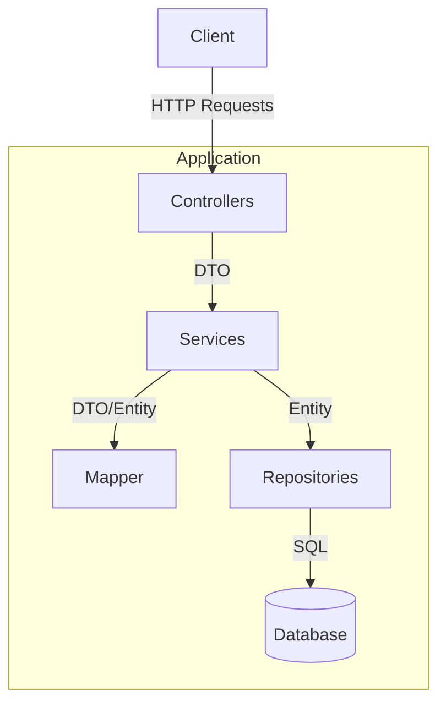
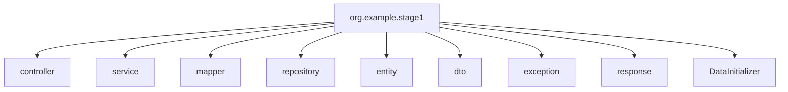
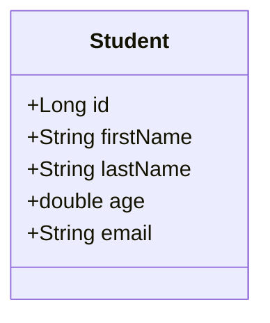
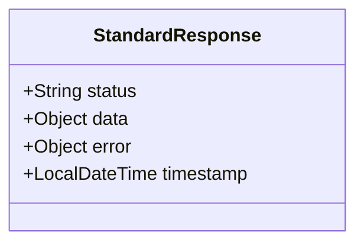

<div dir="rtl">

# מדריך מקיף - פיתוח מערכת ניהול סטודנטים עם Spring Boot, JPA ו-ResponseEntity<StandardResponse>

## תוכן עניינים

1. [מבוא: חשיבות הנדסית של התרגיל](#מבוא-חשיבות-הנדסית-של-התרגיל)
2. [ארכיטקטורת המערכת](#ארכיטקטורת-המערכת)
3. [הכנות מקדימות](#הכנות-מקדימות)
4. [שלבי בניית המערכת](#שלבי-בניית-המערכת)
5. [בדיקת המערכת](#בדיקת-המערכת)

## מבוא: חשיבות הנדסית של התרגיל

פיתוח מערכת CRUD פשוטה עם Spring Boot ו-JPA מהווה נקודת התחלה מצוינת ללימוד הנדסת תוכנה מעשית. תרגיל זה, על אף פשטותו
לכאורה, מכיל עקרונות יסוד חשובים:

###   הנדסת תוכנה

הנדסת תוכנה אמיתית עוסקת בהיבטים רחבים :

- **ארכיטקטורה רב-שכבתית** - הפרדה של האפליקציה לשכבות עם אחריות ברורה
- **ניהול תלויות** - הבנה כיצד רכיבים שונים משתלבים
- **ניהול קונפיגורציה** - הגדרת סביבת הפיתוח והייצור
- **אינטגרציה** - חיבור בין מערכות שונות (בסיס נתונים, אפליקציה)

<div dir="rtl">

# היבטים הנדסיים בתרגיל

## 1. שכבתיות וביזור אחריות

<div style="padding-left: 20px;">

- **שכבת ה-Controller** - טיפול בבקשות HTTP, החזרת ResponseEntity<StandardResponse>
- **שכבת ה-Service** - יישום הלוגיקה העסקית והמרות DTO
- **שכבת ה-Repository** - אינטראקציה עם בסיס הנתונים
- **שכבת ה-Entity/Domain** - ייצוג הנתונים
- **שכבת ה-DTO** - העברת נתונים בין שכבות
- **שכבת ה-Mapper** - אחראית על המרה בין אובייקטים מסוגים שונים (DTO, Entity)
- **שכבת ה-Response** - מבנה אחיד לתגובות API (עם StandardResponse)

</div>

## 2. ניהול תצורה והגדרות

<div style="padding-left: 20px;">

- הגדרת חיבור לבסיס הנתונים
- הגדרות JPA
- הגדרות מערכת (לוגים, פורטים)

</div>

## 3. ניהול מחזור חיים

<div style="padding-left: 20px;">

- שימוש ב-DataInitializer להכנסת נתונים ראשוניים
- טיפול בהפעלה ראשונה של המערכת

</div>

## 4. טיפול בשגיאות

<div style="padding-left: 20px;">

- טיפול גלובלי בחריגות
- מיפוי חריגות לקודי תגובה מתאימים
- פורמט תגובות עקבי עם StandardResponse

</div>

## 5. ולידציה ותקינות נתונים

<div style="padding-left: 20px;">

- ולידציה ברמת האובייקט באמצעות אנוטציות
- ולידציה ברמת הלוגיקה העסקית

</div>

## 6. עבודה עם נתונים

<div style="padding-left: 20px;">

- ORM באמצעות JPA והיברנייט
- קשר בין מודל תוכנה לסכמת נתונים
- ניהול תנועת נתונים בין DTO ל-Entity דרך Mapper
- שימוש ב-Transactional לניהול טרנזקציות

</div>

## 7. תכנון REST API

<div style="padding-left: 20px;">

- מיפוי פעולות CRUD לפעולות HTTP
- קודי סטטוס מתאימים (200, 201, 204, 400, 404, 409, 500)
- URI מבוססי משאבים
- החזרת ResponseEntity<StandardResponse> באופן עקבי
- החזרת אובייקטי DTO במקום ישויות

</div>

</div>

## ארכיטקטורת המערכת

### ארכיטקטורה כללית

המערכת בנויה בארכיטקטורת שכבות קלאסית לפי מיטב המסורת של Spring:

</div>



<div dir="rtl">

### שכבות המערכת

1. **Controllers**: שכבת הממשק החיצוני של המערכת המטפלת בבקשות HTTP ומחזירה ResponseEntity<StandardResponse>.
2. **Services**: שכבת הלוגיקה העסקית של המערכת, המטפלת ב-DTO ואחראית על המרות באמצעות Mapper.
3. **Mapper**: שכבה אחראית על המרה בין אובייקטי DTO ל-Entity.
4. **Repositories**: שכבת הגישה למסד הנתונים.
5. **Entities**: המודל של הנתונים במערכת.
6. **DTOs**: אובייקטים להעברת נתונים בין השכבות השונות.
7. **Exceptions**: טיפול בשגיאות ייחודיות למערכת.
8. **Response**: מבנה תגובה אחיד עם StandardResponse.

### מבנה הפרויקט

</div>



<div dir="rtl">

### מודל הנתונים

</div>



<div dir="rtl">

### מודל התגובה (StandardResponse)

</div>



<div dir="rtl">

## הכנות מקדימות

### התקנת MySQL

#### אפשרות 1: התקנה רגילה של MySQL

1. **הורדה והתקנה**:
   - עבור Windows/macOS: הורידו את [MySQL Community Server](https://dev.mysql.com/downloads/mysql/)
   - עבור Linux (Ubuntu): `sudo apt install mysql-server`

2. **קונפיגורציה ראשונית**:
   - משתמש `root` עם סיסמה (למשל `admin`)
   - פורט 3306 (ברירת מחדל)

3. **יצירת סכמה**:

</div>

```sql
CREATE DATABASE stage1_db;
```

<div dir="rtl">

#### אפשרות 2: התקנת MySQL באמצעות Docker

</div>

```bash
docker run --name mysql-stage1 -e MYSQL_ROOT_PASSWORD=admin -e MYSQL_DATABASE=stage1_db -p 3306:3306 -d mysql:8.0
```

<div dir="rtl">

### התקנת כלי ניהול (אופציונלי)

- **MySQL Workbench**: הורידו מ[אתר MySQL](https://dev.mysql.com/downloads/workbench/)
- **DBeaver**: כלי קוד פתוח מ[אתר DBeaver](https://dbeaver.io/download/)

## שלבי בניית המערכת

### 1. הקמת פרויקט Spring Boot

1. **צרו פרויקט חדש באמצעות Spring Initializr**:
   - Group ID: `org.example`
   - Artifact ID: `stage1`
   - Java 17 או גרסה גבוהה יותר
   - תלויות: Spring Web, Spring Data JPA, MySQL Driver, Lombok, Validation

## תלויות ופלאגינים של pom.xml

### זה מה שאמור להופיע לאחר בחירת התלויות בקובץ pom.xml:
</div>

```xml
<dependencies>
    <!-- Spring Data JPA - provides data access via JPA -->
    <dependency>
        <groupId>org.springframework.boot</groupId>
        <artifactId>spring-boot-starter-data-jpa</artifactId>
    </dependency>
    
    <!-- Spring Web - support for RESTful and web applications -->
    <dependency>
        <groupId>org.springframework.boot</groupId>
        <artifactId>spring-boot-starter-web</artifactId>
    </dependency>
    <!-- MySQL JDBC Driver - driver for connecting to MySQL database -->
    <dependency>
        <groupId>com.mysql</groupId>
        <artifactId>mysql-connector-j</artifactId>
        <scope>runtime</scope>
    </dependency>
    
    <!-- Lombok - reducing boilerplate code -->
    <dependency>
        <groupId>org.projectlombok</groupId>
        <artifactId>lombok</artifactId>
        <optional>true</optional>
    </dependency>
    
    <!-- Spring Boot Test - framework and support for testing -->
    <dependency>
        <groupId>org.springframework.boot</groupId>
        <artifactId>spring-boot-starter-test</artifactId>
        <scope>test</scope>
    </dependency>
    
    <!-- Bean Validation - declarative validation -->
    <dependency>
        <groupId>org.springframework.boot</groupId>
        <artifactId>spring-boot-starter-validation</artifactId>
    </dependency>
</dependencies>
<build>
    <plugins>
        <!-- Maven Compiler Plugin - configuration for Lombok -->
        <plugin>
            <groupId>org.apache.maven.plugins</groupId>
            <artifactId>maven-compiler-plugin</artifactId>
            <configuration>
                <annotationProcessorPaths>
                    <path>
                        <groupId>org.projectlombok</groupId>
                        <artifactId>lombok</artifactId>
                    </path>
                </annotationProcessorPaths>
            </configuration>
        </plugin>
        
        <!-- Spring Boot Maven Plugin - building and packaging Spring Boot application -->
        <plugin>
            <groupId>org.springframework.boot</groupId>
            <artifactId>spring-boot-maven-plugin</artifactId>
            <configuration>
                <excludes>
                    <exclude>
                        <groupId>org.projectlombok</groupId>
                        <artifactId>lombok</artifactId>
                    </exclude>
                </excludes>
            </configuration>
        </plugin>
    </plugins>
</build>
```

<div dir="rtl">

# מבנה הפרויקט Spring Boot - Stage1

## מבנה החבילות (Packages)

</div>

```
org.example.stage1                       # Project Root Package
├── controller                           # Controllers Layer - HTTP Request Handlers
│   └── StudentController                # Student Management Controller
│
├── dto                                  # Data Transfer Objects
│   └── StudentDto                       # Student Data Transfer Object
│
├── entity                               # JPA Entity Layer
│   └── Student                          # Student Entity (Database Model)
│
├── exception                            # Exception Handling
│   ├── AlreadyExists                    # Entity Already Exists Exception
│   ├── GlobalExceptionHandler           # Centralized Exception Handler
│   ├── NotExists                        # Entity Not Found Exception
│   └── StudentIdAndIdMismatch           # ID Mismatch Exception
│
├── mapper                               # Object Mappers
│   └── StudentMapper                    # Student <-> StudentDto Converter
│
├── repository                           # Data Access Layer
│   └── StudentRepository                # Student Database Operations Interface
│
├── response                             # API Response Handling
│   └── StandardResponse                 # Standardized API Response Structure
│
├── service                              # Business Logic Layer
│   ├── StudentService                   # Student Service Interface
│   ├── StudentServiceImpl               # Student Service Implementation
│   └── DataInitializer                  # Initial Data Bootstrapper
│
└── Stage1Application                    # Application Entry Point
```

<div dir="rtl">

### תפקידי החבילות השונות

1. **controller** - מכילה את הבקרים שאחראים על טיפול בבקשות HTTP ומיפוי נתיבי REST
2. **dto** (Data Transfer Objects) - מכילה אובייקטים המשמשים להעברת נתונים בין שכבות
3. **entity** - מכילה ישויות JPA המייצגות טבלאות בבסיס הנתונים
4. **exception** - מכילה מחלקות חריגה מותאמות אישית ומנגנון טיפול מרכזי בחריגות
5. **mapper** - אחראית על המרה בין ישויות ל-DTO וחזרה
6. **repository** - מכילה ממשקי JPA להתקשרות עם בסיס הנתונים
7. **response** - אחראית על מבנה תגובות אחיד ברחבי המערכת
8. **service** - מכילה את הלוגיקה העסקית של האפליקציה

### שכבתיות המערכת

הארכיטקטורה מבוססת על עקרון הפרדת האחריות (Separation of Concerns), עם זרימת מידע טיפוסית:

</div>

```
Controller → Service → Repository → Database
    ↑          ↑          ↑
    DTO      Entity    Entity
```

<div dir="rtl">

הפרדה זו מקלה על תחזוקת הקוד, מאפשרת בדיקות מבודדות, ותומכת בעקרונות SOLID.

### 2. הגדרת application.properties

</div>

```properties
# Application name as it will appear in Spring Boot Actuator and monitoring tools
spring.application.name=Stage1

# DataSource Configuration 
# MySQL URL - assuming the server is listening on port 3306
# createDatabaseIfNotExist=true creates the database if it doesn't exist
spring.datasource.url=jdbc:mysql://localhost:3306/stage1_db?createDatabaseIfNotExist=true

# Connection credentials - assuming username is 'root' and password is 'admin'
# These values should be changed in production environment!
spring.datasource.username=root
spring.datasource.password=admin

# MySQL JDBC driver class
spring.datasource.driver-class-name=com.mysql.cj.jdbc.Driver

# JPA and Hibernate Configuration
# update - updates the schema according to entity model but doesn't delete existing data
spring.jpa.hibernate.ddl-auto=update

# Show SQL statements in logs - useful for debugging
spring.jpa.show-sql=true

# Format SQL for better readability in logs
spring.jpa.properties.hibernate.format_sql=true

# Hibernate dialect for MySQL 8 - assuming you're using this version or newer
spring.jpa.properties.hibernate.dialect=org.hibernate.dialect.MySQL8Dialect
```

<div dir="rtl">

### העמקה בשימוש ב-ResponseEntity עם StandardResponse

כדי ליצור REST API מקצועי עם תגובות עקביות, אנו משתמשים בשילוב של `StandardResponse` ו-`ResponseEntity`:

**בקרים עם `ResponseEntity<StandardResponse>`**:
- החזרת `ResponseEntity` מאפשרת שליטה בקודי הסטטוס HTTP ובכותרות
- שימוש ב-StandardResponse מספק מבנה תגובה אחיד ללקוח
- מודל תגובה אחיד מקל על הטיפול בתשובות בצד הלקוח

**יתרונות המימוש**:
- קל להבחין בין הצלחות לשגיאות דרך שדה ה-status
- ניתן להחזיר נתונים נוספים בצורה עקבית
- כולל timestamp אוטומטי לכל תגובה
- טיפול אחיד בשגיאות דרך GlobalExceptionHandler

**דוגמה לשימוש ב-`ResponseEntity<StandardResponse>`**:

</div>

```java
@GetMapping("/{id}")
public ResponseEntity<StandardResponse> getStudent(@PathVariable Long id) {
    StudentDto student = studentService.getStudentById(id);
    StandardResponse response = new StandardResponse("success", student, null);
    return ResponseEntity.ok(response);
}
```

<div dir="rtl">

**דוגמה לתגובת הצלחה**:

</div>

```json
{
  "status": "success",
  "data": {
    "id": 1,
    "firstName": "John",
    "lastName": "Doe",
    "age": 21.5,
    "email": "john.doe@example.com"
  },
  "error": null,
  "timestamp": "2023-08-06T15:22:45.123"
}
```

<div dir="rtl">

**דוגמה לתגובת שגיאה**:

</div>

```json
{
  "status": "error",
  "data": null,
  "error": {
    "type": "Resource Not Found",
    "message": "Student with id 999 does not exist"
  },
  "timestamp": "2023-08-06T15:26:45.123"
}
```

<div dir="rtl">

### קודי תגובה HTTP מתאימים

הבקר שלנו משתמש בקודי תגובה HTTP מתאימים:
- **200 OK**: לשליפת נתונים ועדכון מוצלח
- **201 Created**: ליצירת משאב חדש (כולל כותרת Location עם URI למשאב החדש)
- **204 No Content**: למחיקת משאב מוצלחת
- **400 Bad Request**: לשגיאות ולידציה ואי-התאמת ID
- **404 Not Found**: למשאב שלא נמצא
- **409 Conflict**: לניסיון ליצור משאב שכבר קיים
- **500 Internal Server Error**: לשגיאות כלליות

### 3. יצירת מחלקת Entity

</div>

```java
package org.example.stage1.entity;

import jakarta.persistence.*;
import jakarta.validation.constraints.*;
import lombok.AllArgsConstructor;
import lombok.Data;
import lombok.NoArgsConstructor;
import lombok.ToString;

@Entity
@Table(name = "students")
@Data
@NoArgsConstructor
@AllArgsConstructor
@ToString
public class Student {

    @Id
    @GeneratedValue(strategy = GenerationType.IDENTITY)
    private Long id;

    @NotBlank(message = "First name is required")
    @Size(min = 2, max = 50, message = "First name must be between 2 and 50 characters")
    @Column(name = "first_name", nullable = false, length = 50)
    private String firstName;

    @NotBlank(message = "Last name is required")
    @Size(min = 2, max = 50, message = "Last name must be between 2 and 50 characters")
    @Column(name = "last_name", nullable = false, length = 50)
    private String lastName;

    @Min(value = 0, message = "Age must be a positive number")
    @Column(nullable = false)
    private double age;

    @NotBlank(message = "Email is required")
    @Email(message = "Email should be valid")
    @Column(unique = true, nullable = false, length = 100)
    private String email;
}
```

<div dir="rtl">

### 4. יצירת מחלקת DTO

</div>

```java
package org.example.stage1.dto;

import jakarta.validation.constraints.*;
import lombok.AllArgsConstructor;
import lombok.Data;
import lombok.NoArgsConstructor;

@Data
@NoArgsConstructor
@AllArgsConstructor
public class StudentDto {
    private Long id;

    @NotBlank(message = "First name is required")
    @Size(min = 2, max = 50, message = "First name must be between 2 and 50 characters")
    private String firstName;

    @NotBlank(message = "Last name is required")
    @Size(min = 2, max = 50, message = "Last name must be between 2 and 50 characters")
    private String lastName;

    @Min(value = 0, message = "Age must be a positive number")
    private double age;

    @NotBlank(message = "Email is required")
    @Email(message = "Email should be valid")
    private String email;
}
```

<div dir="rtl">

### 5. יצירת ממשק Repository

</div>

```java
package org.example.stage1.repository;

import org.example.stage1.entity.Student;
import org.springframework.data.jpa.repository.JpaRepository;
import org.springframework.stereotype.Repository;

import java.util.Optional;

@Repository
public interface StudentRepository extends JpaRepository<Student, Long> {
    Optional<Student> findByEmail(String email);
}
```

<div dir="rtl">

### 6. יצירת מחלקת Mapper

מחלקת הMapper אחראית על המרה בין אובייקטי DTO ל-Entity ולהיפך. זהו נוהג נפוץ בארכיטקטורות מודרניות:

</div>

```java
package org.example.stage1.mapper;

import org.example.stage1.dto.StudentDto;
import org.example.stage1.entity.Student;
import org.springframework.stereotype.Component;

/**
 * This class is responsible for mapping between DTO objects and entities
 */
@Component
public class StudentMapper {

    /**
     * map StudentDto to Student
     *
     * @param dto for conversion
     * @return new Student entity
     */
    public Student toEntity(StudentDto dto) {
        if (dto == null) {
            return null;
        }

        Student student = new Student();
        student.setId(dto.getId());
        student.setFirstName(dto.getFirstName());
        student.setLastName(dto.getLastName());
        student.setAge(dto.getAge());
        student.setEmail(dto.getEmail());

        return student;
    }

    /**
     * map Student to StudentDto
     * 
     * @param entity entity for conversion
     * @return new StudentDto
     */
    public StudentDto toDto(Student entity) {
        if (entity == null) {
            return null;
        }

        StudentDto dto = new StudentDto();
        dto.setId(entity.getId());
        dto.setFirstName(entity.getFirstName());
        dto.setLastName(entity.getLastName());
        dto.setAge(entity.getAge());
        dto.setEmail(entity.getEmail());

        return dto;
    }

    /**
     * update the existing Student entity with the data from the DTO
     *
     * @param entity the entity to update
     * @param dto the DTO with the new data, if null, no update will be performed
     */
    public void updateEntityFromDto(Student entity, StudentDto dto) {
        if (entity == null || dto == null) {
            return;
        }

        // update basic fields
        entity.setFirstName(dto.getFirstName());
        entity.setLastName(dto.getLastName());
        entity.setAge(dto.getAge());
        entity.setEmail(dto.getEmail());
    }
}
```

<div dir="rtl">

### 7. יצירת מחלקות Exception

</div>

```java
// AlreadyExists.java
package org.example.stage1.exception;

/**
 * Exception thrown when a resource already exists in the system.
 * For example, when trying to add a student with an email that already exists.
 */
public class AlreadyExists extends RuntimeException {
    public AlreadyExists(String message) {
        super(message);
    }
}
```

```java
// NotExists.java
package org.example.stage1.exception;

/**
 * Exception thrown when a resource does not exist in the system.
 * For example, when trying to retrieve a student that does not exist.
 */
public class NotExists extends RuntimeException {
    public NotExists(String message) {
        super(message);
    }
}
```

```java
// StudentIdAndIdMismatch.java
package org.example.stage1.exception;

/**
 * Exception thrown when the ID in the path does not match the ID in the request body.
 * This is used to ensure that the correct student is being updated.
 */
public class StudentIdAndIdMismatch extends RuntimeException {
    public StudentIdAndIdMismatch(String message) {
        super(message);
    }
}
```

<div dir="rtl">

### 8. יצירת מחלקות StandardResponse

#### StandardResponse.java

</div>

```java
package org.example.stage1.response;

import lombok.AllArgsConstructor;
import lombok.Data;
import lombok.NoArgsConstructor;

import java.time.LocalDateTime;

/**
 * Standard response wrapper for all API responses.
 * Provides consistent structure for all API responses.
 */
@Data
@NoArgsConstructor
@AllArgsConstructor
public class StandardResponse {
    /**
     * Status of the response (success, error, warning, etc.)
     */
    private String status;
    
    /**
     * Payload data of the response
     */
    private Object data;
    
    /**
     * Error object in case of errors
     */
    private Object error;
    
    /**
     * Timestamp of the response
     */
    private LocalDateTime timestamp;
    
    public StandardResponse(String status, Object data, Object error) {
        this.status = status;
        this.data = data;
        this.error = error;
        this.timestamp = LocalDateTime.now();
    }
}
```

<div dir="rtl">

### 9. יצירת GlobalExceptionHandler

</div>

```java
package org.example.stage1.exception;

import org.example.stage1.response.StandardResponse;
import org.springframework.http.HttpStatus;
import org.springframework.http.ResponseEntity;
import org.springframework.web.bind.MethodArgumentNotValidException;
import org.springframework.web.bind.annotation.ControllerAdvice;
import org.springframework.web.bind.annotation.ExceptionHandler;
import org.springframework.web.context.request.WebRequest;

import java.util.HashMap;
import java.util.Map;

/**
 * GlobalExceptionHandler, this class is used to handle exceptions globally
 * instead of handling them in each controller separately.
 */
@ControllerAdvice
public class GlobalExceptionHandler {

    /**
     * takes care of the exception when a resource is not found, 404 Not Found
     */
    @ExceptionHandler(NotExists.class)
    public ResponseEntity<StandardResponse> handleNotExists(NotExists ex, WebRequest request) {
        Map<String, String> details = new HashMap<>();
        details.put("type", "Resource Not Found");
        details.put("message", ex.getMessage());
        
        StandardResponse response = new StandardResponse("error", null, details);
        return new ResponseEntity<>(response, HttpStatus.NOT_FOUND);
    }

    /**
     * takes care of the exception when a resource already exists, 409 Conflict
     * This is more appropriate than 400 Bad Request when trying to create a resource with an ID that already exists
     */
    @ExceptionHandler(AlreadyExists.class)
    public ResponseEntity<StandardResponse> handleAlreadyExists(AlreadyExists ex, WebRequest request) {
        Map<String, String> details = new HashMap<>();
        details.put("type", "Resource Conflict");
        details.put("message", ex.getMessage());
        
        StandardResponse response = new StandardResponse("error", null, details);
        return new ResponseEntity<>(response, HttpStatus.CONFLICT);
    }

    /**
     * takes care of the exception when there's an ID mismatch, 400 Bad Request
     */
    @ExceptionHandler(StudentIdAndIdMismatch.class)
    public ResponseEntity<StandardResponse> handleIdMismatch(StudentIdAndIdMismatch ex, WebRequest request) {
        Map<String, String> details = new HashMap<>();
        details.put("type", "ID Mismatch");
        details.put("message", ex.getMessage());
        
        StandardResponse response = new StandardResponse("error", null, details);
        return new ResponseEntity<>(response, HttpStatus.BAD_REQUEST);
    }

    /**
     * Exception handler for @Valid validation errors, such as @NotNull, @Size, etc.
     * BadRequest 400
     */
    @ExceptionHandler(MethodArgumentNotValidException.class)
    public ResponseEntity<StandardResponse> handleValidationExceptions(MethodArgumentNotValidException ex, WebRequest request) {
        Map<String, String> errors = new HashMap<>();

        ex.getBindingResult().getFieldErrors().forEach(error ->
                errors.put(error.getField(), error.getDefaultMessage())
        );

        Map<String, Object> details = new HashMap<>();
        details.put("type", "Validation Failed");
        details.put("fields", errors);
        
        StandardResponse response = new StandardResponse("error", null, details);
        return new ResponseEntity<>(response, HttpStatus.BAD_REQUEST);
    }

    /**
     * takes care of general exceptions, 500 Internal Server Error
     */
    @ExceptionHandler(Exception.class)
    public ResponseEntity<StandardResponse> handleGenericException(Exception ex, WebRequest request) {
        Map<String, String> details = new HashMap<>();
        details.put("type", "Internal Server Error");
        details.put("message", ex.getMessage());
        
        StandardResponse response = new StandardResponse("error", null, details);
        return new ResponseEntity<>(response, HttpStatus.INTERNAL_SERVER_ERROR);
    }
}
```

<div dir="rtl">

### 10. יצירת Service ו-ServiceImpl

#### StudentService.java - ממשק שירות מעודכן

</div>

```java
package org.example.stage1.service;

import org.example.stage1.dto.StudentDto;

import java.util.List;

/**
 * Service interface for student operations
 * Works directly with DTOs to handle both data conversion and business logic
 */
public interface StudentService {
    /**
     * Get all students from the system as DTOs
     * @return List of all students as DTOs
     */
    List<StudentDto> getAllStudents();
    
    /**
     * Get student by ID as DTO
     * @param id The student ID to retrieve
     * @return The found student as DTO
     * @throws org.example.stage1.exception.NotExists If a student doesn't exist
     */
    StudentDto getStudentById(Long id);
    
    /**
     * Add a new student
     * @param studentDto Student data to add (as DTO)
     * @return The added student as DTO with generated ID
     * @throws org.example.stage1.exception.AlreadyExists If student with the same email already exists
     */
    StudentDto addStudent(StudentDto studentDto);
    
    /**
     * Update an existing student
     * @param studentDto Updated student data (as DTO)
     * @param id The ID from the path parameter
     * @return The updated student as DTO
     * @throws org.example.stage1.exception.NotExists If a student doesn't exist
     * @throws org.example.stage1.exception.StudentIdAndIdMismatch If ID in a path doesn't match student ID
     * @throws org.example.stage1.exception.AlreadyExists If email is already in use by another student
     */
    StudentDto updateStudent(StudentDto studentDto, Long id);
    
    /**
     * Delete a student by ID
     * @param id Student ID to delete
     * @throws org.example.stage1.exception.NotExists If student doesn't exist
     */
    void deleteStudent(Long id);
}
```

<div dir="rtl">

#### StudentServiceImpl.java - מימוש שירות עם Mapper

</div>

```java
package org.example.stage1.service;

import org.example.stage1.dto.StudentDto;
import org.example.stage1.entity.Student;
import org.example.stage1.exception.AlreadyExists;
import org.example.stage1.exception.NotExists;
import org.example.stage1.exception.StudentIdAndIdMismatch;
import org.example.stage1.mapper.StudentMapper;
import org.example.stage1.repository.StudentRepository;
import org.springframework.beans.factory.annotation.Autowired;
import org.springframework.stereotype.Service;
import org.springframework.transaction.annotation.Transactional;

import java.util.List;
import java.util.stream.Collectors;

/*
 * @Transactional annotations are used in this service layer for several important reasons:
 *
 * 1. Data integrity - Ensures all database operations within a method either complete
 *    successfully or roll back entirely, maintaining data consistency
 *
 * 2. Performance optimization - Using readOnly=true for query methods helps Hibernate
 *    optimize performance by disabling dirty checking and potentially using read replicas
 *
 * 3. Declarative transaction management - Allows Spring to handle transaction boundaries
 *    automatically, reducing error-prone manual transaction handling
 */
@Service
public class StudentServiceImpl implements StudentService {

    private final StudentRepository studentRepository;
    private final StudentMapper studentMapper;

    @Autowired
    public StudentServiceImpl(StudentRepository studentRepository, StudentMapper studentMapper) {
        this.studentRepository = studentRepository;
        this.studentMapper = studentMapper;
    }

    /**
     * Get all students from the system as DTOs
     * @return List of all students as DTOs
     */
    @Override
    @Transactional(readOnly = true)
    public List<StudentDto> getAllStudents() {
        return studentRepository.findAll().stream()
                .map(studentMapper::toDto)
                .collect(Collectors.toList());
    }


    /**
     * Get student by ID as DTO
     * @param id The student ID to retrieve
     * @return The found student as DTO
     * @throws NotExists If a student doesn't exist
     */
    @Override
    @Transactional(readOnly = true)
    public StudentDto getStudentById(Long id) {
        Student student = studentRepository.findById(id)
                .orElseThrow(() -> new NotExists("Student with id " + id + " does not exist"));
                
        return studentMapper.toDto(student);
    }


    /**
     * Add a new student
     * @param studentDto Student data to add (as DTO)
     * @return The added student as DTO
     * @throws AlreadyExists If a student with the same ID already exists
     */
    @Override
    @Transactional
    public StudentDto addStudent(StudentDto studentDto) {
        // Check if a student with the same email already exists
        if (studentRepository.findByEmail(studentDto.getEmail()).isPresent()) {
            throw new AlreadyExists("Student with email " + studentDto.getEmail() + " already exists");
        }

        // Convert DTO to an entity using the mapper
        Student student = studentMapper.toEntity(studentDto);
        
        // Save entity and convert back to DTO
        Student added = studentRepository.save(student);
        return studentMapper.toDto(added);
    }


    /**
     * Update an existing student
     * @param studentDto Updated student data (as DTO)
     * @param id The ID from the path parameter
     * @return The updated student as DTO
     * @throws NotExists If a student doesn't exist
     * @throws StudentIdAndIdMismatch If ID in a path doesn't match student ID
     */
    @Override
    @Transactional
    public StudentDto updateStudent(StudentDto studentDto, Long id) {
        // Check if the ID parameter matches the student's ID (if DTO has ID)
        if (studentDto.getId() != null && !studentDto.getId().equals(id)) {
            throw new StudentIdAndIdMismatch("Path ID " + id + " does not match body ID " + studentDto.getId());
        }

        // Check if a student exists
        Student existingStudent = studentRepository.findById(id)
                .orElseThrow(() -> new NotExists("Student with id " + id + " does not exist"));

        // Check if another student already uses the updated email
        studentRepository.findByEmail(studentDto.getEmail())
                .ifPresent(student -> {
                    if (!student.getId().equals(id)) {
                        throw new AlreadyExists("Email " + studentDto.getEmail() + " is already in use");
                    }
                });

        // Update the existing entity from the DTO
        studentMapper.updateEntityFromDto(existingStudent, studentDto);

        // Save the updated entity and convert back to DTO
        Student updated = studentRepository.save(existingStudent);
        return studentMapper.toDto(updated);
    }


    /**
     * Delete a student by ID
     * @param id Student ID to delete
     * @throws NotExists If a student doesn't exist
     */
    @Override
    @Transactional
    public void deleteStudent(Long id) {
        // Check if a student exists
        if (!studentRepository.existsById(id)) {
            throw new NotExists("Student with id " + id + " does not exist");
        }

        studentRepository.deleteById(id);
    }
}
```

<div dir="rtl">

### 11. יצירת Controller (עם ResponseEntity<StandardResponse>)

</div>

```java
package org.example.stage1.controller;

import jakarta.validation.Valid;
import org.example.stage1.dto.StudentDto;
import org.example.stage1.response.StandardResponse;
import org.example.stage1.service.StudentService;
import org.springframework.http.HttpStatus;
import org.springframework.http.ResponseEntity;
import org.springframework.web.bind.annotation.*;
import org.springframework.web.servlet.support.ServletUriComponentsBuilder;

import java.net.URI;
import java.util.List;

/**
 * REST controller for student operations
 * The controller works directly with DTOs and delegates to the service layer
 * for business logic and data conversion
 */
@RestController
@RequestMapping("/students")
public class StudentController {

    private final StudentService studentService;

    public StudentController(StudentService studentService) {
        this.studentService = studentService;
    }

    /**
     * Get all students
     * Returns ResponseEntity with StandardResponse and 200 OK status
     */
    @GetMapping()
    public ResponseEntity<StandardResponse> getAllStudents() {
        List<StudentDto> students = studentService.getAllStudents();
        StandardResponse response = new StandardResponse("success", students, null);
        return ResponseEntity.ok(response);
    }

    /**
     * Get a student by ID
     * Returns ResponseEntity with StandardResponse and 200 OK status
     */
    @GetMapping("/{id}")
    public ResponseEntity<StandardResponse> getStudent(@PathVariable Long id) {
        StudentDto student = studentService.getStudentById(id);
        StandardResponse response = new StandardResponse("success", student, null);
        return ResponseEntity.ok(response);
    }

    /**
     * Add a new student
     * Uses @Valid to validate a student according to Jakarta Validation constraints
     * Returns ResponseEntity with StandardResponse and 201 Created status with location header
     */
    @PostMapping()
    public ResponseEntity<StandardResponse> addStudent(@Valid @RequestBody StudentDto studentDto) {
        StudentDto added = studentService.addStudent(studentDto);

        URI location = ServletUriComponentsBuilder
                .fromCurrentRequest()
                .path("/{id}")
                .buildAndExpand(added.getId())
                .toUri();

        StandardResponse response = new StandardResponse("success", added, null);
        return ResponseEntity.created(location).body(response);
    }

    /**
     * Update a student
     * Uses @Valid to validate a student according to Jakarta Validation constraints
     * Returns ResponseEntity with StandardResponse and 200 OK status
     * 
     * Note: The path variable ID identifies the resource to update, even though
     * the ID may also be present in the request body
     */
    @PutMapping("/{id}")
    public ResponseEntity<StandardResponse> updateStudent(@Valid @RequestBody StudentDto studentDto, @PathVariable Long id) {
        StudentDto updated = studentService.updateStudent(studentDto, id);
        StandardResponse response = new StandardResponse("success", updated, null);
        return ResponseEntity.ok(response);
    }

    /**
     * Delete a student
     * Returns 204 No Content status without a response body
     */
    @DeleteMapping("/{id}")
    @ResponseStatus(HttpStatus.NO_CONTENT)
    public void deleteStudent(@PathVariable Long id) {
        studentService.deleteStudent(id);
    }
}
```

<div dir="rtl">

### 12. יצירת DataInitializer

</div>

```java
package org.example.stage1;

import org.example.stage1.entity.Student;
import org.example.stage1.repository.StudentRepository;
import org.springframework.beans.factory.annotation.Autowired;
import org.springframework.boot.CommandLineRunner;
import org.springframework.stereotype.Component;

@Component
public class DataInitializer implements CommandLineRunner {

    private final StudentRepository studentRepository;

    @Autowired
    public DataInitializer(StudentRepository studentRepository) {
        this.studentRepository = studentRepository;
    }

    @Override
    public void run(String... args) {
        // Check if there are already records in the database
        if (studentRepository.count() == 0) {
            // Create and save initial data
            studentRepository.save(new Student(null, "John", "Doe", 21.5, "john.doe@example.com"));
            studentRepository.save(new Student(null, "Jane", "Smith", 22.3, "jane.smith@example.com"));
            studentRepository.save(new Student(null, "Alice", "Johnson", 20.7, "alice.johnson@example.com"));
            studentRepository.save(new Student(null, "Bob", "Brown", 23.1, "bob.brown@example.com"));
            studentRepository.save(new Student(null, "Charlie", "Davis", 22.8, "charlie.davis@example.com"));

            System.out.println("Data initialization completed. Created 5 student records.");
        } else {
            System.out.println("Database already contains records. Skipping initialization.");
        }
    }
}
```

<div dir="rtl">

### 13. זה קיים: Main Application

</div>

```java
package org.example.stage1;

import org.springframework.boot.SpringApplication;
import org.springframework.boot.autoconfigure.SpringBootApplication;

@SpringBootApplication
public class Stage1Application {
    public static void main(String[] args) {
        SpringApplication.run(Stage1Application.class, args);
    }
}
```

<div dir="rtl">

## בדיקת המערכת

### 1. הפעלת המערכת

- הפעילו את הפרויקט דרך ה-IDE או באמצעות `./mvnw spring-boot:run`
- וודאו שלא מופיעות שגיאות בקונסולה
- בדקו שה-DataInitializer יצר את הנתונים ההתחלתיים

### 2. בדיקת REST API עם ResponseEntity<StandardResponse>

#### קבלת כל הסטודנטים

</div>

```
GET http://localhost:8080/students
```

<div dir="rtl">

תגובה צפויה:

</div>

```json
{
  "status": "success",
  "data": [
    {
      "id": 1,
      "firstName": "John",
      "lastName": "Doe",
      "age": 21.5,
      "email": "john.doe@example.com"
    },
    ...
  ],
  "error": null,
  "timestamp": "2023-08-06T15:22:45.123"
}
```

<div dir="rtl">

#### הוספת סטודנט חדש

</div>

```
POST http://localhost:8080/students
Content-Type: application/json

{
    "firstName": "David",
    "lastName": "Wilson",
    "age": 21.5,
    "email": "david.wilson@example.com"
}
```

<div dir="rtl">

תגובה צפויה:

</div>

```json
{
  "status": "success",
  "data": {
    "id": 6,
    "firstName": "David",
    "lastName": "Wilson",
    "age": 21.5,
    "email": "david.wilson@example.com"
  },
  "error": null,
  "timestamp": "2023-08-06T15:25:45.123"
}
```

<div dir="rtl">

#### שגיאת ולידציה

</div>

```
POST http://localhost:8080/students
Content-Type: application/json

{
    "firstName": "",
    "lastName": "Wilson",
    "age": 21.5,
    "email": "invalid-email"
}
```

<div dir="rtl">

תגובה צפויה:

</div>

```json
{
  "status": "error",
  "data": null,
  "error": {
    "type": "Validation Failed",
    "fields": {
      "firstName": "First name is required",
      "email": "Email should be valid"
    }
  },
  "timestamp": "2023-08-06T15:26:45.123"
}
```

<div dir="rtl">

# תרשים רצף לתהליכי API במערכת סטודנטים

```mermaid
sequenceDiagram
    participant Client
    participant Controller as StudentController
    participant Service as StudentService
    participant Mapper as StudentMapper
    participant Repo as StudentRepository
    participant DB as Database
    participant ExHandler as GlobalExceptionHandler
    
    rect rgb(2, 76, 0)
    note right of Client: תרחיש הצלחה - קבלת כל הסטודנטים
    Client->>+Controller: GET /students
    Controller->>+Service: getAllStudents()
    Service->>+Repo: findAll()
    Repo->>+DB: SELECT * FROM students
    DB-->>-Repo: ResultSet
    Repo-->>-Service: List<Student>
    Service->>Mapper: toDto() (עבור כל ישות)
    Mapper-->>Service: List<StudentDto>
    Service-->>-Controller: List<StudentDto>
    Controller->>Controller: יצירת StandardResponse
    Controller-->>Client: ResponseEntity<StandardResponse><br>(status: 200 OK)
    deactivate Controller
    end
    
    rect rgb(97, 22, 0)
    note right of Client: תרחיש שגיאה - סטודנט לא קיים
    Client->>+Controller: GET /students/999
    Controller->>+Service: getStudentById(999)
    Service->>+Repo: findById(999)
    Repo->>+DB: SELECT * FROM students WHERE id=999
    DB-->>-Repo: Empty ResultSet
    Repo-->>-Service: Optional.empty()
    Service--xExHandler: זריקת NotExists
    ExHandler->>ExHandler: יצירת StandardResponse שגיאה
    ExHandler-->>Client: ResponseEntity<StandardResponse><br>(status: 404 NOT FOUND)
    deactivate Controller
    end
    
    rect rgb(9, 75, 0)
    note right of Client: תרחיש הצלחה - הוספת סטודנט חדש
    Client->>+Controller: POST /students<br>{firstName: "David", ...}
    Controller->>Controller: בדיקת @Valid
    Controller->>+Service: addStudent(studentDto)
    Service->>+Repo: findByEmail(email)
    Repo->>+DB: SELECT * FROM students WHERE email=?
    DB-->>-Repo: Empty ResultSet
    Repo-->>-Service: Optional.empty()
    Service->>Mapper: toEntity(studentDto)
    Mapper-->>Service: Student
    Service->>+Repo: save(student)
    Repo->>+DB: INSERT INTO students VALUES (...)
    DB-->>-Repo: Generated ID
    Repo-->>-Service: Student
    Service->>Mapper: toDto(student)
    Mapper-->>Service: StudentDto
    Service-->>-Controller: StudentDto
    Controller->>Controller: יצירת StandardResponse<br>חישוב URI למשאב החדש
    Controller-->>Client: ResponseEntity<StandardResponse><br>(status: 201 CREATED,<br>Location: /students/{id})
    deactivate Controller
    end
    
    rect rgb(9, 20, 0)
    note right of Client: תרחיש הצלחה - עדכון סטודנט קיים
    Client->>+Controller: PUT /students/1<br>{firstName: "Updated", ...}
    Controller->>Controller: בדיקת @Valid
    Controller->>+Service: updateStudent(studentDto, 1)
    Service->>+Repo: findById(1)
    Repo->>+DB: SELECT * FROM students WHERE id=1
    DB-->>-Repo: Student Result
    Repo-->>-Service: Optional<Student>
    Service->>+Repo: findByEmail(email)
    Repo->>+DB: SELECT * FROM students WHERE email=?
    DB-->>-Repo: Empty ResultSet or Same Student
    Repo-->>-Service: Optional<Student>
    Service->>Mapper: updateEntityFromDto(existingStudent, studentDto)
    Mapper-->>Service: void (עדכון הישות הקיימת)
    Service->>+Repo: save(existingStudent)
    Repo->>+DB: UPDATE students SET ... WHERE id=1
    DB-->>-Repo: OK
    Repo-->>-Service: Student
    Service->>Mapper: toDto(student)
    Mapper-->>Service: StudentDto
    Service-->>-Controller: StudentDto
    Controller->>Controller: יצירת StandardResponse
    Controller-->>Client: ResponseEntity<StandardResponse><br>(status: 200 OK)
    deactivate Controller
    end
    
    rect rgb(101, 4, 0)
    note right of Client: תרחיש שגיאה - מייל כפול
    Client->>+Controller: POST /students<br>{email: "existing@mail.com", ...}
    Controller->>Controller: בדיקת @Valid
    Controller->>+Service: addStudent(studentDto)
    Service->>+Repo: findByEmail(email)
    Repo->>+DB: SELECT * FROM students WHERE email=?
    DB-->>-Repo: Student Result
    Repo-->>-Service: Optional<Student>
    Service--xExHandler: זריקת AlreadyExists
    ExHandler->>ExHandler: יצירת StandardResponse שגיאה
    ExHandler-->>Client: ResponseEntity<StandardResponse><br>(status: 409 CONFLICT)
    deactivate Controller
    end
    
    rect rgb(101, 82, 0)
    note right of Client: תרחיש מחיקה
    Client->>+Controller: DELETE /students/1
    Controller->>+Service: deleteStudent(1)
    Service->>+Repo: existsById(1)
    Repo->>+DB: SELECT COUNT(*) FROM students WHERE id=1
    DB-->>-Repo: 1
    Repo-->>-Service: true
    Service->>+Repo: deleteById(1)
    Repo->>+DB: DELETE FROM students WHERE id=1
    DB-->>-Repo: OK
    Repo-->>-Service: void
    Service-->>-Controller: void
    Controller-->>Client: 204 No Content<br>(ללא גוף תשובה)
    deactivate Controller
    end
    
```

להלן תרשים רצף המתאר את זרימת המידע במערכת, כולל ResponseEntity<StandardResponse>:

</div>



<div dir="rtl">

פיתוח מערכת CRUD בסיסית עם Spring Boot, JPA, Mapper ו-ResponseEntity<StandardResponse> הוא מיקרוקוסמוס של פיתוח מערכות אמיתיות.
המיומנויות הנרכשות כאן מהוות בסיס איתן להמשך פיתוח מערכות מורכבות יותר.

השדרוגים שביצענו:
1. **עבודה עם ResponseEntity** - שליטה טובה יותר בקודי סטטוס HTTP ובכותרות התשובה
2. **מבנה תגובה אחיד** - StandardResponse לכל הבקשות
3. **העברת לוגיקת ה-DTO לשירות** - מפשט את הבקר ומשפר את הפרדת האחריות
4. **הסטנדרטיזציה של ממשק השירות** - עבודה ישירה עם DTO בשירות
5. **שיפור הקפסולציה** - הסתרת המודל הפנימי לחלוטין מהבקר
6. **עבודה עם @Transactional** - שיפור ניהול הטרנזקציות ויציבות המערכת

שילוב הגישה של החזרת ResponseEntity<StandardResponse> יוצר API מודרני, קל לשימוש, עם הפרדת אחריות ברורה בין השכבות השונות של המערכת.

</div>